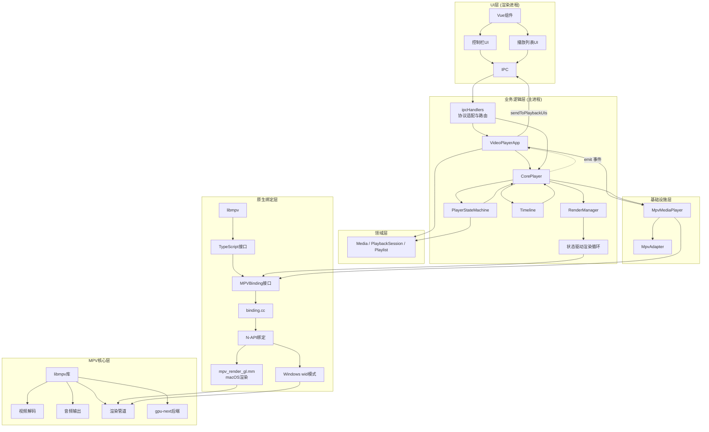
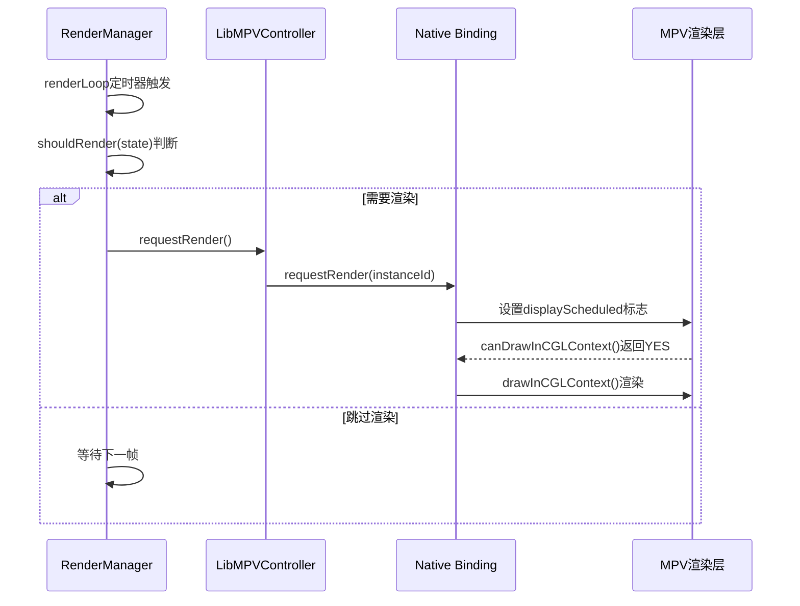
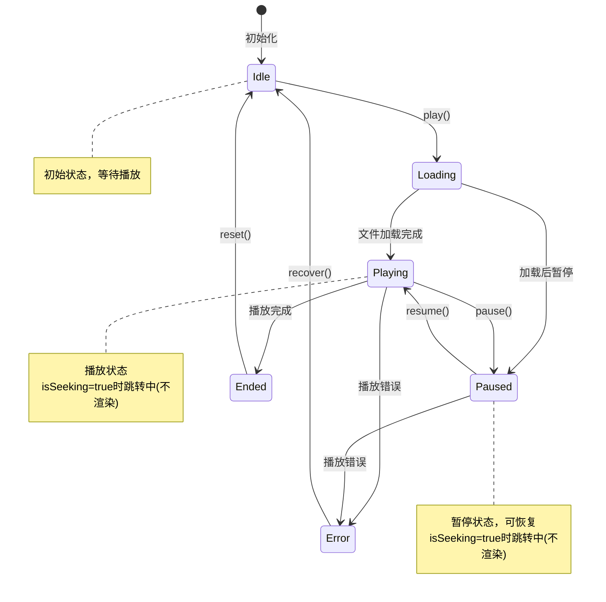

# mpv-player 架构设计文档

## 1. 项目概述与架构概览

### 1.1 项目目标
mpv-player 是一个基于 Electron + Vue + TypeScript 的桌面播放器应用，通过原生 Node Addon API 嵌入 libmpv，专注于在 macOS 上实现正确的 HDR (EDR/PQ) 输出。

**核心特性**：
- Electron + libmpv 渲染 API 嵌入
- macOS HDR 管道：CAOpenGLLayer + PQ 色彩空间 + EDR 启用
- 高级 Dolby Vision 支持（Profile 5 & 8），智能色调映射
- **gpu-next 后端**（libplacebo）提供卓越的 HDR 渲染质量
- 修复字幕渲染问题（旋转/翻转）
- 正确的 SDR 色彩空间处理

### 1.2 技术栈
- **前端**: Vue 3 + TypeScript + Vue Router + Element Plus
- **主进程**: Electron + TypeScript
- **原生模块**: Node Addon API + C++/Objective-C
- **视频渲染**: MPV (libmpv) + gpu-next (libplacebo) 后端
- **构建工具**: electron-vite + node-gyp

### 1.3 核心设计原则
1. **分层架构**: UI层、业务逻辑层、领域层、基础设施层、原生绑定层、MPV核心层
2. **平台抽象**: 统一的接口，平台特定的实现
3. **数据驱动**: 状态机驱动的渲染决策
4. **类型安全**: TypeScript 接口定义，跨进程类型安全
5. **性能优化**: 智能渲染节流，动态渲染间隔调整

## 2. 整体分层架构

### 2.1 分层架构图



**说明**：入口为 `main` → `runApp()`（bootstrap）；`app.whenReady` 后创建 `CorePlayer`、`VideoPlayerApp`，再 `setupIpcHandlers`、`createMainWindow`、`registerAppListeners`。UI 的 IPC 经 **ipcHandlers** 路由到 **VideoPlayerApp** 或 **CorePlayer**；**VideoPlayerApp** 统一负责窗口、播放入口、播放控制（playMedia / pause / seek / setVolume / stop）、播放列表、IPC 广播；**CorePlayer** 负责 MPV 桥接、渲染、状态与事件，发出 `video-time-update`、`player-state` 等，由 VideoPlayerApp 监听并转发。**领域层**仅含领域模型；**基础设施层**含 MpvAdapter、MpvMediaPlayer，经原生绑定访问 libmpv。

### 2.2 各层职责说明

| 层级 | 主要组件 | 职责 | 文件位置 |
|------|----------|------|----------|
| **UI层** | Vue组件 | 用户界面、用户交互、IPC通信 | `src/renderer/` |
| **业务逻辑层** | VideoPlayerApp, CorePlayer, PlayerStateMachine, RenderManager | 应用协调、播放控制、状态管理、渲染调度、窗口管理 | `src/main/application/` |
| **领域层** | Media, PlaybackSession, Playlist | 领域模型（媒体、播放会话、播放列表） | `src/main/domain/models/` |
| **基础设施层** | MpvAdapter, MpvMediaPlayer；libmpv, nativeHelper, RenderManager | MPV→领域适配、MediaPlayer 实现、窗口句柄、渲染循环 | `src/main/infrastructure/` |
| **服务层** | MountPathService, NasService | 挂载路径管理、NAS 连接管理、资源扫描 | `src/main/application/services/` |
| **MediaPlayer 接口** | 播放契约（与 CorePlayer 同属应用核心） | 定义在 `application/core/MediaPlayer.ts`，MpvMediaPlayer 实现 | `src/main/application/core/` |
| **原生绑定层** | MPVBinding, binding.cc, mpv_render_gl.mm | 跨语言桥接、平台特定渲染、HDR配置 | `native/` |
| **MPV核心层** | libmpv库 | 视频解码、音频处理、渲染管道、HDR色调映射 | 外部依赖 |

### 2.2.1 主进程组件职责（详细）

以下职责已确认，作为实现与重构的约束。**禁止**在未更新本文档的前提下调整职责归属。

| 组件 | 职责 | 不负责 |
|------|------|--------|
| **VideoPlayerApp** | 应用入口；窗口管理（主窗口/视频窗口/控制栏的创建、显示、隐藏、同步）；播放列表的 **UI 层** facade（`getList` / `setList` / `setCurrentByPath` / `getCurrent` / `next` / `prev`）；**播放入口** `play(target)`：创建视频窗口 → `setVideoWindow` → `ensureControllerReadyForPlayback` → **私有** `sendToPlaybackUIs('play-video', …)` → **私有** `playMedia` → `sendToPlaybackUIs('player-embedded'|'player-error', …)`；**播放控制** `playMedia` / `pausePlayback` / `resumePlayback` / `seek` / `setVolume` / `stopPlayback`（委托 `MediaPlayer` + `Playlist`）；**IPC 业务方法** `handlePlayVideo` / `handlePlayUrl` / `handleControlPlay`（封装列表操作、状态判断等业务逻辑，供 ipcHandlers 调用）；**窗口操作** `toggleFullscreen` / `windowAction`（封装窗口操作逻辑）；**广播方法** `handleFileSelected` / `forwardVideoTimeUpdate` / `forwardVideoEnded` / `showControlBar` / `scheduleHideControlBar`（封装广播逻辑，统一经 `sendToPlaybackUIs` 或直接 `webContents.send`）；`playCurrentFromPlaylist` / `playNext` / `playPrev`；**ended 时自动播放下一首**（监听 `corePlayer.onPlayerState`）；**列表变更广播** `broadcastPlaylistUpdated()`（内部 `sendToPlaybackUIs('playlist-updated', getList())`，ipcHandlers 仅触发）；**监听 CorePlayer 事件**（`video-time-update`、`player-state`）并转发到播放 UI；**退出时** `releaseCorePlayerListeners()` 移除上述监听；HDR、配置、`sendKey` 转调 `corePlayer`；暴露 `getControlWindow` / `getControlView`。**向播放 UI 的广播**（play-video、player-embedded、player-error、playlist-updated、video-time-update、player-state）由 VideoPlayerApp **统一** 经 `sendToPlaybackUIs` 完成。 | 不直接操作 MPV 底层；播放控制经 MediaPlayer 接口。 |
| **CorePlayer** | 播放基础设施与 **MPV 桥接**。继承 `EventEmitter`，通过**事件**通知状态变化。`setVideoWindow`：保存视频窗口引用，并为 `MpvMediaPlayer` 设置 `windowId`。`ensureControllerReadyForPlayback`：在 `playMedia` 前调用；通过 **私有** `prepareControllerForPlayback` 完成 controller 创建、初始化、`setWindowId`、`setExternalController`、`syncWindowSize`、`setupResizeHandler`、`setupEventHandlers`，供 RenderManager / Timeline 使用。`play(filePath)`：复用 `prepareControllerForPlayback`，然后 `mediaPlayer.play(Media.create(filePath))`（保留用于直接播放入径）。暂停/恢复/停止/跳转/音量委托 `mediaPlayer`，部分经 `controller` 同步状态。维护 `PlayerStateMachine`、`Timeline`、`RenderManager`；**发出事件** `video-time-update`（Timeline 驱动）、`player-state`（状态机驱动），由 VideoPlayerApp 监听并转发到播放 UI。**不** 直接发送 IPC；应用层广播归 VideoPlayerApp。 | 不管理播放列表；不实现「播放入口」业务流程；不发送 IPC。 |
| **prepareControllerForPlayback**（CorePlayer 私有） | 获取 `videoWindow` 的 windowId；创建/初始化 `LibMPVController`；`setWindowId`；`renderManager.setController`；`syncWindowSize`、`setupResizeHandler`、`setupEventHandlers`；`mediaPlayer.setExternalController(controller, windowId)`。返回 `windowId`，失败返回 `undefined`。**与 `play()` 共用**，避免重复。 | 不执行 `mediaPlayer.play`；不涉及播放列表或 IPC。 |
| **ipcHandlers** | **IPC 协议适配层**：只做**路由、参数解析、调用 App 方法、event.reply**。**不包含业务逻辑**（如「列表是否已存在」「状态是 ended 还是 playing」等判断）、**不持有状态**（如 `isFullscreen`）、**不直接发送业务广播**（所有广播经 VideoPlayerApp 的 `sendToPlaybackUIs` / `handleFileSelected` / `forwardVideoTimeUpdate` 等）。**路由**：`play-video` / `play-url` → `handlePlayVideo` / `handlePlayUrl`（业务逻辑在 App）；`control-play` → `handleControlPlay`（状态判断在 App）；`control-toggle-fullscreen` / `control-window-action` → `toggleFullscreen` / `windowAction`（窗口操作在 App）；`control-bar-*` → `showControlBar` / `scheduleHideControlBar`（广播在 App）；其他控制直接路由到对应方法。依赖 `videoPlayerApp`、`corePlayer`，不依赖 `main`。 | 不实现业务逻辑；不持有状态；不直接 `webContents.send` 业务广播；不操作窗口（只调用 App 方法）。 |
| **MpvMediaPlayer** | 实现领域 `MediaPlayer`。**外部 controller 路径**：`setExternalController(controller, windowId)` 时使用 CorePlayer 的 controller，不自建；**自建 controller 路径**：仅在未 `setExternalController` 时 `ensureInitialized` 内创建。加载、播放、暂停、恢复、停止、跳转、音量、`getCurrentSession` 等。MPV 状态 → `PlaybackSession` 适配。 | 不管理窗口、不驱动渲染循环；渲染与 Timeline 由 CorePlayer 侧 controller 提供。 |
| **PlayerStateMachine** | 维护 `PlayerPhase`、`isSeeking`、`isNetworkBuffering` 等；从 MPV 状态推导 phase；发出 `state` 事件驱动 Timeline、RenderManager。 | 不直接操作 MPV 或播放列表。 |
| **RenderManager** | 使用 CorePlayer 的 `controller` 驱动 `requestRender`（即 `mpv_render_context_render`）；根据状态、resize、seek 等决定渲染节奏。 | 不解析 MPV 状态；不管理播放列表。 |
| **Timeline** | 轮询 `getStatus`（来自 CorePlayer 的 controller）；通过回调 `send` 触发 CorePlayer 发出 `video-time-update` 事件。 | 不操作 MPV；不管理播放列表；不直接发送 IPC。 |

**播放入口流程（当前约定）**：

```
IPC play-video / play-playlist-current / play-url
  → VideoPlayerApp.play(target)
  → setVideoWindow(videoWindow)
  → ensureControllerReadyForPlayback()   // 即 prepareControllerForPlayback + 校验
  → broadcast play-video
  → playMedia({ ... })                  // 内联逻辑，addToPlaylist: false
  → MpvMediaPlayer.play(media)          // 使用 setExternalController 的 controller
  → broadcast player-embedded / player-error
```

**原则**：窗口、广播、**播放控制**（playMedia / pause / seek / setVolume / stop）与领域操作归 **VideoPlayerApp**；controller 初始化、渲染、状态、进度归 **CorePlayer**。ipcHandlers 仅做 **协议适配与薄编排**，不实现领域逻辑；列表变更广播由 VideoPlayerApp 实现，ipcHandlers 触发。

#### 2.2.2 CorePlayer 与 VideoPlayerApp 关系

| 角色 | 组件 | 职责概要 | 依赖 |
|------|------|----------|------|
| **应用入口 / 编排者** | **VideoPlayerApp** | 窗口管理、播放列表 UI 门面、**播放入口** `play()`、**播放控制** `playMedia` / `pausePlayback` / `resumePlayback` / `seek` / `setVolume` / `stopPlayback`、向播放 UI 的 **IPC 广播**、监听 CorePlayer 事件并转发 | 持有 **CorePlayer**（注入）、Playlist、WindowManager；经 `corePlayer.getMediaPlayer()` 使用 MediaPlayer |
| **播放与渲染桥接** | **CorePlayer** | 管理 controller、RenderManager、Timeline、PlayerStateMachine；`setVideoWindow`、`ensureControllerReadyForPlayback`；**发出** `video-time-update`、`player-state` 等事件 | 持有 MediaPlayer（MpvMediaPlayer）；不依赖 VideoPlayerApp |

**创建与注入**（`bootstrap.runApp`）：

```
createCorePlayer() → core
new VideoPlayerApp(core)
  ├─ 注入 corePlayer
  └─ 自建 playlist、windowManager、config
setupIpcHandlers(videoPlayerApp, corePlayer)
```

**典型调用链**：播放入口与控制（pause / seek / get-playlist 等）均由 ipcHandlers 路由到 **VideoPlayerApp**；**CorePlayer** 负责 MPV 桥接与事件发出，VideoPlayerApp 监听后 `sendToPlaybackUIs` 转发。

#### IPC 通道 → 路由与 reply/broadcast 归属

| IPC 通道 | 路由到 | reply / broadcast 归属 |
|----------|--------|------------------------|
| `play-video` | VideoPlayerApp（setList/setCurrentByPath + play） | 广播 `play-video`、`player-embedded`、`player-error` → VideoPlayerApp.sendToPlaybackUIs；`playlist-updated` → VideoPlayerApp.broadcastPlaylistUpdated（ipcHandlers 触发） |
| `play-url` | VideoPlayerApp | 同上 |
| `set-playlist` | VideoPlayerApp | `playlist-updated` → VideoPlayerApp.broadcastPlaylistUpdated |
| `play-playlist-current` / `next` / `prev` | VideoPlayerApp | 无 reply |
| `get-playlist` | VideoPlayerApp（`getList()`） | **reply** `playlist-updated` ← ipcHandlers |
| `control-pause` / `control-stop` / `control-seek` / `control-volume` | VideoPlayerApp | 无；`setVolume` 内部含 `config.setVolume` 持久化 |
| `control-play` | VideoPlayerApp（ended/stopped 时 `playCurrentFromPlaylist`，否则 `resumePlayback`） | 无 |
| `control-hdr` / `control-toggle-fullscreen` / `control-window-action` / `control-keypress` | VideoPlayerApp 或 CorePlayer | 无 |
| `control-bar-mouse-move` / `control-bar-mouse-leave` | VideoPlayerApp（getControlView/Window）→ 转发 control 窗口 | 无 |
| `video-time-update` | VideoPlayerApp（监听 CorePlayer 事件后 `sendToPlaybackUIs`） | 广播归属 VideoPlayerApp |
| `video-ended` | ipcHandlers 转发到 video 窗口 | 转发归属 ipcHandlers |

### 2.3 层间通信机制

| 通信路径 | 通信机制 | 数据格式 | 同步/异步 |
|----------|----------|----------|-----------|
| UI ↔ 业务逻辑 | IPC (`ipcMain`/`ipcRenderer`) | JSON对象 | 异步 |
| 业务逻辑 ↔ 原生绑定 | TypeScript接口 + N-API | 原生类型转换 | 同步 |
| 原生绑定 ↔ MPV核心 | libmpv C API | MPV数据结构 | 异步事件 |
| 业务逻辑内部 | EventEmitter | TypeScript对象 | 同步/异步 |

## 3. 核心接口与数据结构

### 3.1 MPVBinding 原生接口

`MPVBinding` 接口是 TypeScript 层与 C++ 原生绑定之间的桥梁，定义在 `infrastructure/mpv/types.ts`（内部接口，不导出）。

```typescript
interface MPVBinding {
  // 实例管理
  create(): number
  initialize(instanceId: number): boolean
  destroy(instanceId: number): boolean
  
  // 配置与窗口管理
  setOption(instanceId: number, name: string, value: string | number | boolean): boolean
  setWindowId(instanceId: number, windowId: number): boolean
  setWindowSize(instanceId: number, width: number, height: number): void
  attachView(instanceId: number, viewPtr: number): void
  
  // 播放控制
  loadFile(instanceId: number, path: string): boolean
  command(instanceId: number, args: string[]): boolean
  
  // 属性管理
  getProperty(instanceId: number, name: string): any
  setProperty(instanceId: number, name: string, value: string | number | boolean): boolean
  
  // 渲染控制 (macOS 特定)
  setJsDrivenRenderMode(instanceId: number, enabled: boolean): void
  getJsDrivenRenderMode(instanceId: number): boolean
  requestRender(instanceId: number): void
  
  // 事件系统
  setEventCallback(instanceId: number, callback: (event: any) => void): boolean
  
  // HDR/调试
  setForceBlackMode(instanceId: number, enabled: boolean): void
  setHdrMode(instanceId: number, enabled: boolean): void
  debugHdrStatus(instanceId: number): void
}
```

**详细参数说明**：

| 方法 | 参数 | 类型 | 必填 | 描述 | 返回值 |
|------|------|------|------|------|--------|
| `create()` | - | - | - | 创建MPV实例 | `number` 实例ID |
| `initialize(instanceId)` | `instanceId` | `number` | 是 | 初始化MPV实例 | `boolean` 是否成功 |
| `destroy(instanceId)` | `instanceId` | `number` | 是 | 销毁MPV实例 | `boolean` 是否成功 |
| `setOption(instanceId, name, value)` | `instanceId` | `number` | 是 | MPV实例ID | `boolean` 是否成功 |
| | `name` | `string` | 是 | 选项名称 | |
| | `value` | `string\|number\|boolean` | 是 | 选项值 | |
| `setWindowId(instanceId, windowId)` | `instanceId` | `number` | 是 | MPV实例ID | `boolean` 是否成功 |
| | `windowId` | `number` | 是 | 窗口句柄 | |
| `attachView(instanceId, viewPtr)` | `instanceId` | `number` | 是 | MPV实例ID | `void` |
| | `viewPtr` | `number` | 是 | NSView指针 | |
| `setWindowSize(instanceId, width, height)` | `instanceId` | `number` | 是 | MPV实例ID | `void` |
| | `width` | `number` | 是 | 窗口宽度（像素） | |
| | `height` | `number` | 是 | 窗口高度（像素） | |
| `loadFile(instanceId, path)` | `instanceId` | `number` | 是 | MPV实例ID | `boolean` 是否成功 |
| | `path` | `string` | 是 | 文件路径 | |
| `command(instanceId, args)` | `instanceId` | `number` | 是 | MPV实例ID | `boolean` 是否成功 |
| | `args` | `string[]` | 是 | 命令参数数组 | |
| `getProperty(instanceId, name)` | `instanceId` | `number` | 是 | MPV实例ID | `any` 属性值 |
| | `name` | `string` | 是 | 属性名称 | |
| `setProperty(instanceId, name, value)` | `instanceId` | `number` | 是 | MPV实例ID | `boolean` 是否成功 |
| | `name` | `string` | 是 | 属性名称 | |
| | `value` | `string\|number\|boolean` | 是 | 属性值 | |
| `setEventCallback(instanceId, callback)` | `instanceId` | `number` | 是 | MPV实例ID | `boolean` 是否成功 |
| | `callback` | `(event: any) => void` | 是 | 事件回调函数 | |

### 3.2 LibMPVController 控制器接口

`LibMPVController` 类是业务逻辑层与原生绑定层之间的主要接口，继承自 `EventEmitter`，定义在 `infrastructure/mpv/LibMPVController.ts`。**命名说明**：虽从架构角度看它更像是基础设施层的"客户端"或"适配器"，但"Controller"在此上下文中合理（它确实在"控制"MPV实例），且已在代码库中广泛使用，故保留此命名。

#### 核心方法说明

```typescript
export class LibMPVController extends EventEmitter {
  /**
   * 初始化 MPV 实例
   * @param windowId - 可选的窗口ID（Windows需要）
   * @throws {Error} MPV实例已初始化或初始化失败
   */
  async initialize(windowId?: number): Promise<void>
  
  /**
   * 设置窗口ID（用于嵌入到Electron窗口）
   * @param windowId - 窗口句柄（macOS: NSView指针，Windows: HWND）
   * @throws {Error} MPV实例未初始化或设置失败
   */
  async setWindowId(windowId: number): Promise<void>
  
  /**
   * 设置窗口尺寸
   * @param width - 窗口宽度（物理像素）
   * @param height - 窗口高度（物理像素）
   */
  async setWindowSize(width: number, height: number): Promise<void>
  
  /**
   * 加载视频文件
   * @param path - 文件路径或URL
   * @throws {Error} MPV实例未初始化或加载失败
   */
  async loadFile(path: string): Promise<void>
  
  /**
   * 获取属性值
   * @param name - 属性名称
   * @returns 属性值，失败时返回null
   */
  async getProperty(name: string): Promise<any>
  
  /**
   * 设置属性值
   * @param name - 属性名称
   * @param value - 属性值
   * @throws {Error} MPV实例未初始化或设置失败
   */
  async setProperty(name: string, value: string | number | boolean): Promise<void>
  
  /**
   * 执行MPV命令
   * @param args - 命令参数数组
   * @throws {Error} MPV实例未初始化或执行失败
   */
  async command(...args: string[]): Promise<void>
  
  /**
   * 暂停播放（使用命令提高响应速度）
   * @throws {Error} MPV实例未初始化
   */
  async pause(): Promise<void>
  
  /**
   * 继续播放（使用命令提高响应速度）
   * @throws {Error} MPV实例未初始化
   */
  async play(): Promise<void>
  
  /**
   * 跳转到指定时间
   * @param time - 跳转时间（秒）
   */
  async seek(time: number): Promise<void>
  
  /**
   * 设置音量
   * @param volume - 音量值（0-100）
   */
  async setVolume(volume: number): Promise<void>
  
  /**
   * 停止播放
   */
  async stop(): Promise<void>
  
  /**
   * 设置JavaScript驱动渲染模式
   * @param enabled - true: JS驱动模式，false: CVDisplayLink驱动模式
   */
  setJsDrivenRenderMode(enabled: boolean): void
  
  /**
   * 获取当前渲染模式
   * @returns true表示使用JavaScript驱动渲染模式
   */
  getJsDrivenRenderMode(): boolean
  
  /**
   * 请求渲染（JavaScript驱动模式下使用）
   */
  requestRender(): void
  
  /**
   * 设置HDR启用状态
   * @param enabled - 是否启用HDR
   */
  setHdrEnabled(enabled: boolean): void
  
  /**
   * 获取当前状态
   * @returns MPVStatus对象
   */
  getStatus(): MPVStatus
  
  /**
   * 调试工具：打印视频状态
   */
  async debugVideoState(): Promise<void>
  
  /**
   * 调试工具：打印HDR状态
   */
  async debugHdrStatus(): Promise<void>
  
  /**
   * 发送按键事件
   * @param key - 按键名称
   */
  async keypress(key: string): Promise<void>
  
  /**
   * 清理资源
   */
  async destroy(): Promise<void>
}
```

#### 关键方法调用示例

```typescript
// 初始化MPV实例
const controller = new LibMPVController()
await controller.initialize()

// 设置窗口（macOS需要NSView指针，Windows需要HWND）
const windowId = getWindowHandle(videoWindow) // 平台特定的窗口句柄获取
await controller.setWindowId(windowId)

// 加载并播放视频
await controller.loadFile('/path/to/video.mp4')
await controller.play()

// 控制播放
await controller.pause()
await controller.resume()
await controller.seek(120) // 跳转到2分钟
await controller.setVolume(80)

// 获取视频信息
const width = await controller.getProperty('width')
const height = await controller.getProperty('height')
const fps = await controller.getProperty('estimated-vf-fps')

// 调试
await controller.debugVideoState()
await controller.debugHdrStatus()
```

### 3.3 CorePlayer 核心播放器接口

`CorePlayer` 接口是应用层播放协调的核心契约，定义在 `application/core/corePlayer.ts`。

```typescript
export interface CorePlayer {
  /**
   * 设置视频窗口
   * @param window - Electron BrowserWindow
   */
  setVideoWindow(window: BrowserWindow | null): Promise<void>
  
  /**
   * 在 playMedia 前调用：初始化 controller、挂载窗口、setExternalController
   */
  ensureControllerReadyForPlayback(): Promise<void>
  
  /**
   * 设置控制视图（macOS BrowserView模式）
   * @param view - Electron BrowserView
   */
  setControlView(view: BrowserView | null): void
  
  /**
   * 设置控制窗口（Windows双窗口模式）
   * @param window - Electron BrowserWindow
   */
  setControlWindow(window: BrowserWindow | null): void
  
  /**
   * 播放视频文件
   * @param filePath - 文件路径或URL
   * @throws {Error} 文件加载失败或播放失败
   */
  play(filePath: string): Promise<void>
  
  /**
   * 暂停播放
   */
  pause(): Promise<void>
  
  /**
   * 继续播放
   */
  resume(): Promise<void>
  
  /**
   * 停止播放
   */
  stop(): Promise<void>
  
  /**
   * 跳转到指定时间
   * @param time - 跳转时间（秒）
   */
  seek(time: number): Promise<void>
  
  /**
   * 设置音量
   * @param volume - 音量值（0-100）
   */
  setVolume(volume: number): Promise<void>
  
  /**
   * 检查是否使用嵌入式模式
   * @returns true表示使用libmpv嵌入模式
   */
  isUsingEmbeddedMode(): boolean
  
  /**
   * 清理所有资源
   */
  cleanup(): Promise<void>
  
  /**
   * 获取当前播放器状态
   * @returns PlayerState对象
   */
  getPlayerState(): PlayerState
  
  /**
   * 监听播放器状态变化
   * @param listener - 状态变化回调函数
   */
  onPlayerState(listener: (state: PlayerState) => void): void
  
  /**
   * 移除状态监听器
   * @param listener - 要移除的回调函数
   */
  offPlayerState(listener: (state: PlayerState) => void): void
  
  /**
   * 发送按键到MPV
   * @param key - 按键名称
   */
  sendKey(key: string): Promise<void>
  
  /**
   * 调试：打印视频状态
   */
  debugVideoState(): Promise<void>
  
  /**
   * 调试：打印HDR状态
   */
  debugHdrStatus(): Promise<void>
  
  /**
   * 设置HDR启用状态
   * @param enabled - 是否启用HDR
   */
  setHdrEnabled(enabled: boolean): void
}
```

#### 使用说明

`CorePlayer` 由 `createCorePlayer()` 工厂创建，在 `bootstrap.runApp()` 的 `app.whenReady` 回调中实例化，并注入 `VideoPlayerApp`、`setupIpcHandlers`。**不**在模块顶层导出单例。调用方通过 `VideoPlayerApp`、`ipcHandlers` 间接使用；若需直接访问，经由 `bootstrap.getVideoPlayerApp()` 等提供的引用。

### 3.4 RenderManager 渲染管理器接口

`RenderManager` 类负责管理渲染循环和渲染决策，定义在 `infrastructure/rendering/renderManager.ts`。

```typescript
export class RenderManager {
  /**
   * 构造函数
   * @param controller - LibMPVController实例
   * @param getState - 获取当前状态的函数
   */
  constructor(controller: LibMPVController | null, getState: () => PlayerState)
  
  /**
   * 设置控制器（动态更新）
   * @param controller - LibMPVController实例
   */
  setController(controller: LibMPVController | null): void
  
  /**
   * 启动渲染循环
   */
  start(): void
  
  /**
   * 停止渲染循环
   */
  stop(): void
  
  /**
   * 检查渲染循环是否激活
   * @returns true表示渲染循环正在运行
   */
  isActive(): boolean
  
  /**
   * 根据视频帧率更新渲染间隔
   * @param fps - 视频帧率，null表示未知
   */
  updateFps(fps: number | null): void
  
  /**
   * 标记Seek完成（需要渲染）
   */
  markSeekComplete(): void
  
  /**
   * 标记Resize开始
   */
  markResizeStart(): void
  
  /**
   * 清理所有资源
   */
  cleanup(): void
}
```

#### 渲染决策逻辑

`RenderManager` 使用数据驱动的方式决定是否渲染：

```typescript
private shouldRender(state: PlayerState): boolean {
  // 1. Seek过程中不渲染
  if (state.isSeeking) return false
  
  // 2. Resize过程中不渲染（等待稳定）
  if (this.isResizing) return false
  
  // 3. Seek完成后需要渲染（无论什么状态）
  if (this.pendingSeekRender) {
    this.pendingSeekRender = false
    return true
  }
  
  // 4. Resize完成后需要渲染（非播放状态）
  if (this.pendingResizeRender) {
    this.pendingResizeRender = false
    if (state.phase !== 'playing') return true
    return false
  }
  
  // 5. 正常播放状态渲染
  return state.phase === 'playing'
}
```

### 3.5 PlayerStateMachine 状态机接口

`PlayerStateMachine` 类管理播放器状态，继承自 `EventEmitter`，定义在 `application/state/playerState.ts`。从 MPV 状态推导 phase，发出 `state` 事件驱动 Timeline、RenderManager。

```typescript
export class PlayerStateMachine extends EventEmitter {
  /**
   * 获取当前状态
   * @returns PlayerState对象
   */
  getState(): PlayerState
  
  /**
   * 设置播放阶段
   * @param phase - 播放阶段
   * @param error - 错误信息（可选）
   */
  setPhase(phase: PlayerPhase, error?: string | null): void
  
  /**
   * 设置错误状态
   * @param message - 错误信息
   */
  setError(message: string): void
  
  /**
   * 从MPV状态更新
   * @param status - MPVStatus对象
   */
  updateFromStatus(status: MPVStatus): void
}
```

## 4. 数据结构定义

### 4.1 MPVStatus 接口

`MPVStatus` 接口表示 MPV 内部状态，定义在 `infrastructure/mpv/types.ts`。

```typescript
export interface MPVStatus {
  position: number          // 当前播放位置（秒）
  duration: number          // 视频总时长（秒）
  volume: number            // 音量（0-100）
  path: string | null       // 当前文件路径
  phase?: PlayerPhase       // 播放阶段
  isSeeking?: boolean       // 是否正在跳转
  isCoreIdle?: boolean      // 核心是否空闲
  isIdleActive?: boolean    // 是否处于激活空闲状态
  isNetworkBuffering?: boolean      // 是否网络缓冲
  networkBufferingPercent?: number  // 网络缓冲百分比
}
```

**字段说明**：

| 字段 | 类型 | 必填 | 描述 | 示例值 |
|------|------|------|------|--------|
| `position` | `number` | 是 | 当前播放位置（秒） | `123.45` |
| `duration` | `number` | 是 | 视频总时长（秒） | `3600` |
| `volume` | `number` | 是 | 音量（0-100） | `80` |
| `path` | `string \| null` | 是 | 当前文件路径 | `"/video.mp4"` |
| `phase` | `PlayerPhase` | 否 | 播放阶段 | `"playing"` |
| `isSeeking` | `boolean` | 否 | 是否正在跳转（辅助状态标志） | `false` |
| `isCoreIdle` | `boolean` | 否 | 核心是否空闲 | `false` |
| `isIdleActive` | `boolean` | 否 | 是否激活空闲 | `false` |
| `isNetworkBuffering` | `boolean` | 否 | 是否网络缓冲 | `true` |
| `networkBufferingPercent` | `number` | 否 | 网络缓冲百分比 | `75` |

### 4.2 PlayerState 接口

`PlayerState` 接口表示应用程序的播放器状态，定义在 `application/state/playerStateTypes.ts`。

```typescript
export interface PlayerState {
  phase: PlayerPhase        // 播放阶段: idle/loading/playing/paused/stopped/ended/error
  currentTime: number       // 当前时间
  duration: number          // 总时长
  volume: number            // 音量
  path: string | null       // 文件路径
  error: string | null      // 错误信息
  isSeeking: boolean        // 是否跳转中
  isCoreIdle: boolean       // 核心空闲
  isIdleActive: boolean     // 激活空闲
  isNetworkBuffering: boolean      // 网络缓冲中
  networkBufferingPercent: number  // 缓冲百分比
}
```

### 4.3 PlayerPhase 枚举

`PlayerPhase` 类型定义播放器的所有可能状态，定义在 `application/state/playerStateTypes.ts`。

```typescript
export type PlayerPhase = 
  | 'idle'      // 空闲状态
  | 'loading'   // 加载中
  | 'playing'   // 播放中
  | 'paused'    // 已暂停
  | 'stopped'   // 已停止
  | 'ended'     // 播放结束
  | 'error'     // 错误状态
```

**状态说明**：

| 状态 | 描述 | 触发条件 |
|------|------|----------|
| `idle` | 初始空闲状态 | 应用启动、播放器重置 |
| `loading` | 文件加载中 | 调用 `play()` 方法 |
| `playing` | 正常播放 | 文件加载完成、恢复播放 |
| `paused` | 暂停状态 | 调用 `pause()` 方法，可以 seek |
| `stopped` | 停止状态 | 调用 `stop()` 方法 |
| `ended` | 播放结束 | 视频播放完成 |
| `error` | 错误状态 | 加载失败、播放错误 |

### 4.4 PlaylistItem 接口

`PlaylistItem` 接口表示播放列表项，定义在 `application/videoPlayerApp.ts`。

```typescript
export interface PlaylistItem {
  path: string  // 文件路径或URL
  name: string  // 显示名称
}
```

### 4.5 领域模型与应用层（语义化重构）

主进程业务逻辑已引入领域模型与应用服务，结构如下：

| 层次 | 组件 | 职责 |
|------|------|------|
| **领域模型** | `Media`, `PlaybackSession`, `Playlist` | 业务实体与状态 |
| **应用编排** | `VideoPlayerApp` | 窗口、播放入口、播放控制（`playMedia` / `pause` / `seek` / `setVolume` / `stop`）、播放列表、IPC 广播 |
| **基础设施** | `MpvAdapter`, `MpvMediaPlayer` | MPV 状态→领域模型、播放器实现 |
| **表现** | `PlayerStateMachine`, `videoPlayerApp` | 对内使用 `PlaybackSession`/`Playlist`；`playerState` 内联 `sessionToPlayerState`，`videoPlayerApp` 持单一 `playlist`（`Playlist`）并通过 `getList`/`setList` 等暴露 `PlaylistItem`，无独立适配器模块 |

IPC 层：`control-pause`、`control-seek`、`get-playlist`、`control-play` 等路由到 **VideoPlayerApp**；窗口管理与播放列表设置等经 `videoPlayerApp`。

## 5. IPC通信设计

### 5.1 IPC架构概览

IPC（进程间通信）是渲染进程（UI）与主进程（业务逻辑）之间的主要通信机制。通过 `preload.ts` 暴露安全的 API 给渲染进程。

**通信路径**：
```
渲染进程 (Vue组件) → preload脚本 → IPC通道 → 主进程 (ipcHandlers)
  → VideoPlayerApp / CorePlayer
  → 领域层 (Playlist、领域模型) / 基础设施层 (MpvMediaPlayer) / CorePlayer → MPV
```
`control-pause`、`control-seek`、`get-playlist`、`control-play` 等经 **VideoPlayerApp**；`play-video`、`set-playlist`、窗口操作等经 `VideoPlayerApp` 或 `CorePlayer`。

### 5.2 electronAPI 接口

`preload` 暴露的 API，定义在 `src/preload/preload.ts`。

```typescript
contextBridge.exposeInMainWorld('electronAPI', {
  platform: process.platform,
  
  // IPC 通信方法
  send: (channel: string, data?: any) => {
    ipcRenderer.send(channel, data)
  },
  
  on: (channel: string, callback: (data: any) => void) => {
    ipcRenderer.on(channel, (_, data) => callback(data))
  },
  
  removeListener: (channel: string, callback: (data: any) => void) => {
    ipcRenderer.removeListener(channel, callback)
  }
})
```

### 5.3 IPC消息通道

#### 渲染进程 → 主进程消息

| 消息通道 | 参数类型 | 描述 | 处理函数位置 |
|----------|----------|------|--------------|
| `select-video-file` | 无 | 选择视频文件 | `application/presentation/ipcHandlers.ts` |
| `play-video` | `{name: string, path: string}` | 播放视频 | `application/presentation/ipcHandlers.ts` |
| `get-playlist` | 无 | 获取播放列表 | `application/presentation/ipcHandlers.ts` |
| `control-pause` | 无 | 暂停播放 | `application/presentation/ipcHandlers.ts` |
| `control-play` | 无 | 继续播放 | `application/presentation/ipcHandlers.ts` |
| `play-url` | `string` | 播放 URL | `application/presentation/ipcHandlers.ts` |
| `control-stop` | 无 | 停止播放 | `application/presentation/ipcHandlers.ts` |
| `control-seek` | `number` | 跳转到时间 | `application/presentation/ipcHandlers.ts` |
| `control-volume` | `number` | 设置音量 | `application/presentation/ipcHandlers.ts` |
| `control-hdr` | `boolean` | 设置 HDR | `application/presentation/ipcHandlers.ts` |
| `control-toggle-fullscreen` | 无 | 切换全屏 | `application/presentation/ipcHandlers.ts` |
| `control-window-action` | `'close' \| 'minimize' \| 'maximize'` | 窗口操作 | `application/presentation/ipcHandlers.ts` |
| `set-playlist` | `PlaylistItem[]` | 设置播放列表 | `application/presentation/ipcHandlers.ts` |
| `play-playlist-current` | 无 | 播放当前项 | `application/presentation/ipcHandlers.ts` |
| `play-playlist-next` | 无 | 播放下一项 | `application/presentation/ipcHandlers.ts` |
| `play-playlist-prev` | 无 | 播放上一项 | `application/presentation/ipcHandlers.ts` |
| `control-keypress` | `string` | 发送按键 | `application/presentation/ipcHandlers.ts` |
| `debug-hdr-status` | 无 | 调试 HDR 状态 | `application/presentation/ipcHandlers.ts` |
| `select-mount-path` | 无 | 选择挂载路径 | `application/presentation/ipcHandlers.ts` |
| `mount-path-add` | `{path: string}` | 添加挂载路径 | `application/presentation/ipcHandlers.ts` |
| `mount-path-remove` | `{id: string}` | 移除挂载路径 | `application/presentation/ipcHandlers.ts` |
| `mount-path-refresh` | `{id: string}` | 刷新扫描挂载路径 | `application/presentation/ipcHandlers.ts` |
| `get-mount-paths` | 无 | 获取挂载路径列表 | `application/presentation/ipcHandlers.ts` |
| `nas-test-connection` | `{config: NasConfig}` | 测试 NAS 连接 | `application/presentation/ipcHandlers.ts` |
| `nas-add` | `{name: string, config: NasConfig}` | 添加 NAS 连接 | `application/presentation/ipcHandlers.ts` |
| `nas-remove` | `{id: string}` | 移除 NAS 连接 | `application/presentation/ipcHandlers.ts` |
| `nas-refresh` | `{id: string}` | 刷新扫描 NAS 连接 | `application/presentation/ipcHandlers.ts` |
| `get-nas-connections` | 无 | 获取 NAS 连接列表 | `application/presentation/ipcHandlers.ts` |

#### 主进程 → 渲染进程消息

| 消息通道 | 参数类型 | 描述 | 发送位置 |
|----------|----------|------|----------|
| `video-file-selected` | `{name: string, path: string}` | 文件已选择 | `application/presentation/ipcHandlers.ts` |
| `playlist-updated` | `PlaylistItem[]` | 播放列表更新 | VideoPlayerApp.sendToPlaybackUIs / ipcHandlers reply（get-playlist） |
| `player-state` | `PlayerState` | 播放器状态 | VideoPlayerApp（监听 CorePlayer 事件后 sendToPlaybackUIs） |
| `player-embedded` | `{embedded: boolean, mode: string}` | 嵌入模式状态 | `application/videoPlayerApp.ts` |
| `player-error` | `{message: string}` | 播放错误 | `application/videoPlayerApp.ts` |
| `video-time-update` | `{currentTime: number, duration: number}` | 时间更新 | VideoPlayerApp（Timeline→CorePlayer emit→监听转发） |
| `video-ended` | 无 | 视频结束 | `application/presentation/ipcHandlers.ts` 转发 |
| `control-bar-show` | 无 | 显示控制栏 | `application/presentation/ipcHandlers.ts` |
| `control-bar-schedule-hide` | 无 | 计划隐藏控制栏 | `application/presentation/ipcHandlers.ts` |
| `mount-path-added` | `{mountPath: MountPath, resources: ScannedResource[]}` | 挂载路径已添加 | `application/services/mountPathService.ts` |
| `mount-path-removed` | `{id: string}` | 挂载路径已移除 | `application/services/mountPathService.ts` |
| `mount-path-scanned` | `{id: string, resources: ScannedResource[]}` | 挂载路径扫描完成 | `application/services/mountPathService.ts` |
| `mount-paths-updated` | `{mountPaths: MountPath[]}` | 挂载路径列表更新 | `application/services/mountPathService.ts` |
| `nas-test-connection-result` | `{success: boolean, error?: string}` | NAS 连接测试结果 | `application/presentation/ipcHandlers.ts` |
| `nas-connection-added` | `{connection: NasConnection, resources: ScannedResource[]}` | NAS 连接已添加 | `application/services/nasService.ts` |
| `nas-connection-removed` | `{id: string}` | NAS 连接已移除 | `application/services/nasService.ts` |
| `nas-connection-scanned` | `{id: string, resources: ScannedResource[], status?: string, error?: string}` | NAS 连接扫描完成 | `application/services/nasService.ts` |
| `nas-connections-updated` | `{connections: NasConnection[]}` | NAS 连接列表更新 | `application/services/nasService.ts` |
| `nas-connection-error` | `{message: string}` | NAS 连接错误 | `application/presentation/ipcHandlers.ts` |

### 5.4 服务层组件

#### 5.4.1 MountPathService 挂载路径服务

`MountPathService` 负责管理本地挂载路径，定义在 `application/services/mountPathService.ts`。

**主要功能**：
- 添加/移除挂载路径
- 扫描挂载路径中的视频文件
- 持久化挂载路径配置
- 通过 IPC 与渲染进程通信

**接口**：
```typescript
export class MountPathService {
  addMountPath(path: string): Promise<MountPath>
  removeMountPath(id: string): boolean
  refreshMountPath(id: string): Promise<void>
  getAllMountPaths(): MountPath[]
  getMountPath(id: string): MountPath | undefined
  setMainWindow(window: BrowserWindow | null): void
}
```

#### 5.4.2 NasService NAS 连接服务

`NasService` 负责管理 NAS（网络附加存储）连接，定义在 `application/services/nasService.ts`。

**主要功能**：
- 管理 NAS 连接配置（SMB/CIFS 协议）
- 测试 NAS 连接
- 扫描 NAS 上的视频文件
- 使用 Electron 的 `safeStorage` API 加密存储密码
- 构建 SMB 路径（`smb://` 格式）供 MPV 播放

**接口**：
```typescript
export class NasService {
  testConnection(config: NasConfig): Promise<{success: boolean, error?: string}>
  addNasConnection(name: string, config: NasConfig): Promise<NasConnection>
  removeNasConnection(id: string): boolean
  refreshNasConnection(id: string): Promise<void>
  getAllNasConnections(): NasConnection[]
  getNasConnection(id: string): NasConnection | undefined
  buildResourcePath(connection: NasConnection, resourcePath: string): string
  setMainWindow(window: BrowserWindow | null): void
}
```

**NAS 配置结构**：
```typescript
interface NasConfig {
  protocol: 'smb'
  host: string              // 主机地址（IP 或域名）
  share: string             // 共享名称
  username?: string         // 用户名（可选）
  password?: string         // 密码（可选，加密存储）
  port?: number             // 端口（可选，默认 445）
  path?: string             // 共享内的子路径（可选）
}
```

**安全存储**：
- 使用 Electron 的 `safeStorage.encryptString()` 加密密码
- 密码以 base64 编码的加密缓冲区形式存储
- 读取时使用 `safeStorage.decryptString()` 解密

**路径构建**：
- SMB 路径格式：`smb://[username[:password]@]host[:port]/share[/path]`
- 在 macOS 上，SMB 共享需要先通过系统挂载（通常在 `/Volumes/ShareName`）
- 扫描时检查 `/Volumes` 下的挂载点，如果存在则扫描挂载点路径

### 5.5 IPC通信示例

**渲染进程发送消息**：
```typescript
// Vue组件中
window.electronAPI.send('play-video', {
  name: 'video.mp4',
  path: '/path/to/video.mp4'
})

window.electronAPI.send('control-seek', 120) // 跳转到2分钟
window.electronAPI.send('control-volume', 75) // 设置音量
```

**渲染进程接收消息**：
```typescript
// 初始化时注册监听器
window.electronAPI.on('player-state', (state) => {
  console.log('播放器状态更新:', state)
  // 更新UI状态
})

window.electronAPI.on('playlist-updated', (playlist) => {
  console.log('播放列表更新:', playlist)
  // 更新播放列表UI
})
```

**主进程处理IPC消息**：
```typescript
// application/presentation/ipcHandlers.ts 示例
ipcMain.on('play-video', async (event, file: { name: string; path: string }) => {
  const currentList = videoPlayerApp.getList()
  let nextList = currentList
  if (!currentList.some(item => item.path === file.path)) {
    nextList = [...currentList, { name: file.name, path: file.path }]
    videoPlayerApp.setList(nextList)
  }
  videoPlayerApp.setCurrentByPath(file.path)
  await videoPlayerApp.play({ path: file.path, name: file.name })
  if (nextList.length > 0) {
    videoPlayerApp.broadcastPlaylistUpdated()
  }
})
```

## 6. 平台抽象与实现

### 6.1 平台差异对比

| 特性 | macOS实现 | Windows实现 | 代码位置 |
|------|-----------|-------------|----------|
| **渲染API** | OpenGL + CAOpenGLLayer | Direct3D + WID嵌入 | `mpv_render_gl.mm` |
| **窗口集成** | BrowserView 覆盖 | 双窗口模式 | `application/videoPlayerApp.ts` |
| **渲染驱动** | JavaScript 驱动或 CVDisplayLink | MPV 内部驱动 | `infrastructure/rendering/renderManager.ts` |
| **HDR支持** | 完整 EDR 支持 | 有限支持 | `native/mpv_render_gl.mm` |
| **窗口句柄** | NSView 指针 | HWND | `infrastructure/platform/nativeHelper.ts` |
| **初始化** | `vo=libmpv` | `vo=gpu-next` | `infrastructure/mpv/LibMPVController.ts` |
| **控制层** | BrowserView | BrowserWindow | `application/videoPlayerApp.ts` |

### 6.2 平台检测与条件编译

**TypeScript中的平台检测**：
```typescript
// 检测当前平台
if (process.platform === 'darwin') {
  // macOS特定逻辑
} else if (process.platform === 'win32') {
  // Windows特定逻辑
}

// 架构检测
if (process.arch === 'arm64' && process.platform === 'darwin') {
  // Apple Silicon特定优化
}
```

**C++/Objective-C中的条件编译**：
```cpp
// binding.cc
#ifdef __APPLE__
    // macOS特定实现
    mpv_create_gl_context_for_view()
    mpv_set_js_driven_render_mode()
#elif defined(_WIN32)
    // Windows特定实现
    // 使用wid嵌入模式
#endif
```

### 6.3 窗口句柄获取

`infrastructure/platform/nativeHelper.ts` 提供平台特定的窗口句柄获取函数：

```typescript
// macOS: 获取NSView指针
export function getNSViewPointer(window: BrowserWindow): number | null {
  if (process.platform !== 'darwin') return null
  const nativeHandle = window.getNativeWindowHandle()
  const viewPtr = nativeHandle.readBigUInt64LE(0)
  return Number(viewPtr)
}

// Windows: 获取HWND指针
export function getHWNDPointer(window: BrowserWindow): number | null {
  if (process.platform !== 'win32') return null
  if (process.arch === 'x64' || process.arch === 'arm64') {
    return Number(nativeHandle.readBigUInt64LE(0))
  } else {
    return nativeHandle.readUInt32LE(0)
  }
}
```

### 6.4 渲染初始化差异

**macOS 渲染初始化**（`infrastructure/mpv/LibMPVController.ts`）：
```typescript
if (process.platform === 'darwin') {
  await this.setOption('vo', 'libmpv')
  // 使用render API，把libmpv绑定到Electron的NSView上
  mpvBinding!.attachView(this.instanceId, windowId)
  mpvBinding!.setHdrMode(this.instanceId, this.hdrEnabled)
  // 默认启用JavaScript驱动渲染模式
  mpvBinding!.setJsDrivenRenderMode(this.instanceId, true)
}
```

**Windows 渲染初始化**（`infrastructure/mpv/LibMPVController.ts`）：
```typescript
if (process.platform === 'win32') {
  await this.setOption('vo', 'gpu-next')
  // Windows上，如果提供了windowId，在初始化前设置wid
  if (windowId !== undefined) {
    console.log('[libmpv] Setting wid to HWND:', windowId, '(0x' + windowId.toString(16) + ')')
    try {
      const result = mpvBinding!.setWindowId(this.instanceId, windowId)
      if (result) {
        console.log('[libmpv] ✅ Set wid before initialization (Windows)')
      }
    } catch (error) {
      console.error('[libmpv] ❌ Exception while setting wid:', error)
    }
  }
}
```

## 7. 渲染架构详解

### 7.1 JavaScript驱动渲染模式

#### 7.1.1 架构概述

JavaScript驱动渲染模式是macOS上的一种创新渲染策略，解决了CVDisplayLink与Electron窗口系统的集成问题。该模式通过TypeScript层的`RenderManager`智能决策何时渲染，而不是依赖原生的定时器。

**工作流程**：
```
RenderManager.renderLoop() → shouldRender()判断 → requestRender() → 
原生层设置displayScheduled标志 → CAOpenGLLayer.canDrawInCGLContext() → 
允许渲染 → drawInCGLContext()执行
```

#### 7.1.2 渲染决策流程图



#### 7.1.3 渲染决策条件表

| 条件 | 是否渲染 | 理由 | 代码位置 |
|------|----------|------|----------|
| `state.isSeeking = true` | ❌ 否 | Seek 过程中不渲染 | `infrastructure/rendering/renderManager.ts` |
| `this.isResizing = true` | ❌ 否 | Resize 过程中不渲染 | `infrastructure/rendering/renderManager.ts` |
| `this.pendingSeekRender = true` | ✅ 是 | Seek 完成后需要渲染 | `infrastructure/rendering/renderManager.ts` |
| `state.phase = 'playing'` | ✅ 是 | 正常播放状态 | `infrastructure/rendering/renderManager.ts` |
| `state.phase = 'paused'` | ❌ 否 | 暂停状态不主动渲染 | `infrastructure/rendering/renderManager.ts` |
| `this.pendingResizeRender = true` | ✅ 是 | Resize 完成后（非播放状态） | `infrastructure/rendering/renderManager.ts` |

#### 7.1.4 渲染间隔动态调整

`RenderManager` 根据视频帧率动态调整渲染间隔：

```typescript
private checkAndAdjustRenderInterval(): void {
  const now = Date.now()
  const actualInterval = now - this.lastRenderRequestTime
  
  // 如果实际间隔明显小于设置的间隔，说明渲染跟不上
  const threshold = this.currentRenderInterval * 0.8
  
  if (actualInterval < threshold && actualInterval > 0) {
    // 渲染跟不上，降低间隔（增加频率）
    const newInterval = Math.max(
      this.MIN_RENDER_INTERVAL_MS,
      Math.floor(this.currentRenderInterval * this.ADJUSTMENT_FACTOR)
    )
    this.currentRenderInterval = newInterval
  } else if (actualInterval >= this.baseRenderInterval * 0.9 && 
             this.currentRenderInterval < this.baseRenderInterval) {
    // 渲染跟上了，恢复到基础间隔
    this.currentRenderInterval = this.baseRenderInterval
  }
}
```

**性能参数**：

| 参数 | 默认值 | 范围 | 作用 |
|------|--------|------|------|
| `DEFAULT_RENDER_INTERVAL_MS` | 20ms | 16-42ms | 基础渲染间隔 |
| `MIN_RENDER_INTERVAL_MS` | 16ms | - | 最小渲染间隔 |
| `ADJUSTMENT_FACTOR` | 0.75 | 0.5-0.9 | 调整因子 |
| `CHECK_INTERVAL` | 10 | - | 检查间隔 |

### 7.2 macOS渲染实现细节

#### 7.2.1 CAOpenGLLayer渲染流程

`mpv_render_gl.mm` 中的关键方法：

```objective-c
- (BOOL)canDrawInCGLContext:(CGLContextObj)ctx
                pixelFormat:(CGLPixelFormatObj)pf
               forLayerTime:(CFTimeInterval)t
                displayTime:(const CVTimeStamp *)ts {
  // JavaScript驱动模式下，只有当displayScheduled为true时才允许渲染
  if (rc->jsDrivenRenderMode.load()) {
    return rc->displayScheduled.load() && rc->needRedraw.load();
  }
  
  // 渲染节流：根据视频帧率动态计算最小渲染间隔
  uint64_t nowMs = (uint64_t)(CACurrentMediaTime() * 1000.0);
  uint64_t lastRenderMs = rc->lastRenderTimeMs.load();
  
  // 根据视频帧率计算最小渲染间隔
  double fps = rc->videoFps.load();
  uint64_t minIntervalMs = GLRenderContext::DEFAULT_MIN_RENDER_INTERVAL_MS;
  if (fps > 0.1) {
    uint64_t calculatedMs = (uint64_t)(1000.0 / fps);
    minIntervalMs = std::max(8ULL, std::min(calculatedMs, 33ULL));
  }
  
  if (lastRenderMs > 0 && (nowMs - lastRenderMs) < minIntervalMs) {
    return NO; // 跳过本次渲染
  }
  
  return rc->needRedraw.load();
}
```

#### 7.2.2 HDR配置

macOS上的HDR配置通过`CAOpenGLLayer`实现：

```objective-c
// 检测HDR内容并启用EDR
- (void)update_hdr_mode {
  if (!rc->hdrUserEnabled.load()) {
    rc->hdrActive = false;
    return;
  }
  
  // 检测视频参数
  const char* gamma = nullptr;
  const char* primaries = nullptr;
  mpv_get_property_string(rc->mpvHandle, "video-params/gamma", &gamma);
  mpv_get_property_string(rc->mpvHandle, "video-params/primaries", &primaries);
  
  bool isHdr = false;
  if (gamma && strcmp(gamma, "pq") == 0) {
    isHdr = true;
  } else if (gamma && strcmp(gamma, "hlg") == 0) {
    isHdr = true;
  }
  
  rc->hdrActive = isHdr;
  
  // 启用EDR
  if (@available(macOS 14.0, *)) {
    rc->glLayer.wantsExtendedDynamicRangeContent = rc->hdrActive;
  }
  
  mpv_free(gamma);
  mpv_free(primaries);
}
```

## 8. 状态机设计与迁移

### 8.0 状态分类

状态机使用**主状态 + 辅助状态标志**的设计：

- **主状态 (`phase`)**：`idle`, `loading`, `playing`, `paused`, `stopped`, `ended`, `error`
  - 这些是互斥的状态，同一时间只能有一个主状态
  - 主状态决定播放器的基本行为

- **辅助状态标志**：`isSeeking`, `isNetworkBuffering` 等
  - 这些是布尔标志，可以与主状态组合
  - 不影响主状态的迁移，只影响特定行为（如渲染）

**示例**：
- `phase='playing'` + `isSeeking=true`：播放状态下的跳转中
- `phase='paused'` + `isSeeking=true`：暂停状态下的跳转中
- Seek 完成后，`isSeeking=false`，但 `phase` 保持不变

### 8.1 状态迁移图



**说明**：
- `isSeeking` 是辅助状态标志，不是独立状态
- `Playing` 和 `Paused` 状态下都可以执行 `seek()`，此时 `isSeeking=true`
- Seek 过程中 `phase` 保持不变（仍为 `playing` 或 `paused`）
- Seek 完成后 `isSeeking=false`，`phase` 保持不变

### 8.2 状态迁移矩阵

| 当前状态 | 事件/操作 | 下一状态 | 辅助状态变化 | 条件/说明 |
|----------|-----------|----------|--------------|-----------|
| `Idle` | `play(filePath)` | `Loading` | - | 开始加载文件 |
| `Loading` | 文件加载完成 | `Playing` | - | 自动播放 |
| `Loading` | 加载后暂停 | `Paused` | - | 暂停标志已设置 |
| `Playing` | `pause()` | `Paused` | - | 暂停播放 |
| `Paused` | `resume()` | `Playing` | - | 恢复播放 |
| `Playing` | `seek(time)` | `Playing` | `isSeeking=true` | 开始跳转，phase不变 |
| `Paused` | `seek(time)` | `Paused` | `isSeeking=true` | 开始跳转，phase不变 |
| `Playing` (isSeeking=true) | 跳转完成 | `Playing` | `isSeeking=false` | 跳转结束，保持播放状态 |
| `Paused` (isSeeking=true) | 跳转完成 | `Paused` | `isSeeking=false` | 跳转结束，保持暂停状态 |
| `Playing` | 播放完成 | `Ended` | - | 到达视频末尾 |
| `Ended` | 重置 | `Idle` | - | 播放器重置 |
| `Playing`/`Paused` | 错误发生 | `Error` | - | 播放错误 |
| `Error` | 恢复 | `Idle` | - | 错误处理完成 |

**说明**：
- `isSeeking` 是辅助状态标志，不影响主状态 `phase`
- Seek 操作不会改变 `phase`，只会设置 `isSeeking` 标志
- Seek 过程中 `phase` 保持为 `playing` 或 `paused`

### 8.3 状态机实现

`PlayerStateMachine` 的核心状态推导逻辑：

```typescript
private derivePhase(status: MPVStatus): PlayerPhase {
  if (this.state.phase === 'error') {
    return 'error'
  }
  if (this.state.phase === 'paused') {
    return 'paused'  // 暂停状态保持不变
  }
  if (this.state.phase === 'stopped') {
    return 'stopped'
  }
  if (!status.path) {
    return 'idle'
  }
  if (status.duration > 0 && status.position >= status.duration) {
    return 'ended'
  }
  return 'playing'
}
```

**关键点**：
- `isSeeking` 是独立的状态标志，不影响 `phase` 的推导
- Seek 操作时，`phase` 保持为 `playing` 或 `paused`，只有 `isSeeking` 标志变化
- 这允许在暂停状态下也能执行 seek 操作

### 8.4 辅助状态说明

#### isSeeking 标志

- **作用**：标记是否正在执行跳转操作
- **特点**：
  - 不影响主状态 `phase`（`playing` 或 `paused` 保持不变）
  - 在 `Playing` 和 `Paused` 状态下都可以设置
  - Seek 过程中不进行渲染（`infrastructure/rendering/renderManager.ts`）
  - Seek 完成后需要渲染一次（同上）

**使用场景**：
```typescript
// 播放状态下 seek
state.phase = 'playing'
state.isSeeking = true  // 开始跳转
// ... 跳转中 ...
state.isSeeking = false // 跳转完成，phase 仍为 'playing'

// 暂停状态下 seek
state.phase = 'paused'
state.isSeeking = true  // 开始跳转
// ... 跳转中 ...
state.isSeeking = false // 跳转完成，phase 仍为 'paused'
```

### 8.5 状态更新机制

状态更新通过MPV事件驱动：

```typescript
// infrastructure/mpv/LibMPVController.ts 中的事件处理
case MPV_EVENT_PROPERTY_CHANGE: {
  const name: string | undefined = event?.name
  const value = event?.value

  switch (name) {
    case 'pause':
      if (this.currentStatus.path) {
        this.currentStatus.phase = value ? 'paused' : 'playing'
      }
      break
    case 'time-pos':
      this.currentStatus.position = typeof value === 'number' ? value : 0
      break
    case 'duration':
      this.currentStatus.duration = typeof value === 'number' ? value : 0
      break
    // ... 其他属性处理
  }
  
  this.emit('status', { ...this.currentStatus })
  break
}
```

## 9. 错误处理与调试

### 9.1 错误传播链

```
MPV错误 → MPV_EVENT_END_FILE(reason=ERROR) → handleEvent() → 
phase='error' → PlayerStateMachine → 'state'事件； 
播放失败时 VideoPlayerApp.play() catch → sendToPlaybackUIs('player-error') → UI显示错误
```

### 9.2 MPV错误处理

```typescript
case MPV_EVENT_END_FILE: {
  const reason: number | null = event?.endFileReason
  if (reason === MPV_END_FILE_REASON_ERROR) {
    this.currentStatus.phase = 'error'
    this.currentStatus.isSeeking = false
    this.currentStatus.isNetworkBuffering = false
    this.currentStatus.networkBufferingPercent = 0
    this.emit('status', { ...this.currentStatus })
    this.emit('ended')
  }
  break
}
```

**文件结束原因常量**：

| 常量 | 值 | 描述 |
|------|-----|------|
| `MPV_END_FILE_REASON_EOF` | 0 | 正常结束 |
| `MPV_END_FILE_REASON_STOP` | 2 | 手动停止 |
| `MPV_END_FILE_REASON_QUIT` | 3 | 退出 |
| `MPV_END_FILE_REASON_ERROR` | 4 | 错误 |
| `MPV_END_FILE_REASON_REDIRECT` | 5 | 重定向 |

### 9.3 资源管理与清理

**多层清理机制**：

```typescript
async cleanup(): Promise<void> {
  // 1. 停止渲染循环
  this.renderManager?.cleanup()
  
  // 2. 清除定时器
  if (this.pendingResizeTimer) {
    clearTimeout(this.pendingResizeTimer)
    this.pendingResizeTimer = null
  }
  
  // 3. 停止时间轴
  this.timeline?.dispose()
  
  // 4. 销毁MPV实例
  if (this.controller) {
    await this.controller.stop()
    await this.controller.destroy()
    this.controller = null
  }
  
  // 5. 清理视图引用
  this.controlView = null
}
```

### 9.4 调试工具

#### 9.4.1 视频状态调试

`debugVideoState()` 方法打印详细的视频参数：

```typescript
async debugVideoState(): Promise<void> {
  const width = await this.getProperty('width')
  const height = await this.getProperty('height')
  const primaries = await this.getProperty('video-params/primaries')
  const gamma = await this.getProperty('video-params/gamma')
  const toneMapping = await this.getProperty('tone-mapping')
  const targetPeak = await this.getProperty('target-peak')
  
  console.log('=== MPV Video State Debug ===')
  console.log(`Video size: ${width}x${height}`)
  console.log(`primaries: ${primaries}`)
  console.log(`gamma (transfer): ${gamma}`)
  console.log(`tone-mapping: ${toneMapping}`)
  console.log(`target-peak: ${targetPeak}`)
  console.log('============================')
}
```

#### 9.4.2 HDR状态调试

`debugHdrStatus()` 方法打印HDR相关信息：

```typescript
async debugHdrStatus(): Promise<void> {
  const dvProfile = await this.getProperty('current-tracks/video/dolby-vision-profile')
  const primaries = await this.getProperty('video-params/primaries')
  const gamma = await this.getProperty('video-params/gamma')
  console.log(
    `[debug-hdr-status] dvProfile=${dvProfile ?? '(null)'} primaries=${primaries ?? '(null)'} gamma=${gamma ?? '(null)'}`
  )
  mpvBinding!.debugHdrStatus(this.instanceId)
}
```

#### 9.4.3 IPC调试命令

通过IPC发送 `debug-hdr-status` 触发调试：

```typescript
// Vue组件中
window.electronAPI.send('debug-hdr-status')

// 或通过按键（Shift+H）— application/videoPlayerApp.ts 中 before-input-event 处理
if (input.shift && (input.key === 'H' || input.key === 'h')) {
  corePlayer.debugVideoState().catch(() => {})
  return
}
```

## 10. 性能优化指南

### 10.1 渲染性能优化

#### 10.1.1 渲染节流策略

| 场景 | 优化策略 | 实现位置 |
|------|----------|----------|
| 高帧率视频 | 动态调整渲染间隔 | `infrastructure/rendering/renderManager.ts` |
| Seek 操作 | 跳过中间帧渲染 | `infrastructure/rendering/renderManager.ts` |
| 窗口调整 | 防抖稳定后渲染 | `infrastructure/rendering/renderManager.ts` |
| 低性能设备 | 降低渲染频率 | `infrastructure/rendering/renderManager.ts` |

#### 10.1.2 视频帧率自适应

```typescript
updateFps(fps: number | null): void {
  if (fps && fps > 0.1) {
    // 根据视频帧率计算基础渲染间隔：1000ms / fps
    // 限制范围：最小 16ms (60fps)，最大 42ms (24fps)
    const calculatedInterval = Math.round(1000 / fps)
    this.baseRenderInterval = Math.max(16, Math.min(calculatedInterval, 42))
    this.currentRenderInterval = this.baseRenderInterval
    console.log(`[RenderManager] 📹 Video FPS: ${fps.toFixed(2)}, Base render interval: ${this.baseRenderInterval}ms`)
  }
}
```

### 10.2 响应性优化

#### 10.2.1 命令 vs 属性设置

使用MPV命令而不是属性设置以提高响应速度：

```typescript
// 使用命令（更快）
async pause(): Promise<void> {
  mpvBinding!.command(this.instanceId, ['set', 'pause', 'yes'])
}

// 而不是属性设置（较慢）
async pause(): Promise<void> {
  await this.setProperty('pause', true)
}
```

#### 10.2.2 Apple Silicon硬件解码

```typescript
if (process.arch === 'arm64' && process.platform === 'darwin') {
  try {
    await this.setOption('hwdec', 'videotoolbox')
    console.log('[libmpv] ✅ Enabled hardware decoding (VideoToolbox) for Apple Silicon')
  } catch (error) {
    console.warn('[libmpv] Failed to enable hardware decoding:', error)
  }
}
```

#### 10.2.3 响应性优化设置

```typescript
// 优化响应速度的设置
try {
  // 降低 OSD 复杂度
  await this.setOption('osd-level', 1)
  // 使用音频同步模式以提高响应性
  await this.setOption('video-sync', 'audio')
  // 减少输入队列大小以提高响应速度
  await this.setOption('input-queue-size', 2)
  // 启用视频延迟优化
  await this.setOption('video-latency-hacks', true)
  console.log('[libmpv] ✅ Applied responsiveness optimizations')
} catch (error) {
  // 忽略，某些选项可能不支持
}
```

### 10.3 内存管理

#### 10.3.1 资源清理顺序

```typescript
// 正确的清理顺序
1. 停止渲染循环（`RenderManager.cleanup()`）
2. 清除定时器 (clearTimeout)
3. 停止时间轴 (timeline.dispose())
4. 停止MPV播放 (controller.stop())
5. 销毁MPV实例 (controller.destroy())
6. 清理视图引用 (controlView = null)
```

#### 10.3.2 事件监听器管理

避免内存泄漏，正确管理事件监听器：

```typescript
// 添加监听器
this.controller.on('status', this.handleStatus)

// 移除监听器（在清理时）
this.controller.removeAllListeners('status')
this.controller.removeAllListeners('file-loaded')
this.controller.removeAllListeners('fps-change')
```

### 10.4 网络缓冲优化

```typescript
// 监控网络缓冲状态
case 'paused-for-cache':
  this.currentStatus.isNetworkBuffering = !!value
  break
case 'cache-buffering-state':
  this.currentStatus.networkBufferingPercent =
    typeof value === 'number' ? value : this.currentStatus.networkBufferingPercent
  break
```

## 11. 扩展与维护指南

### 11.1 添加新功能步骤

#### 11.1.1 通用流程

1. **定义接口**: 在对应接口中添加方法声明
2. **实现业务逻辑**: 在对应类中实现方法
3. **添加 IPC 支持**：在 `application/presentation/ipcHandlers.ts` 中添加处理
4. **更新UI**: 在Vue组件中添加调用
5. **测试**: 验证功能正常工作

#### 11.1.2 示例：添加播放速度控制

**步骤1：在CorePlayer接口添加方法**
```typescript
// application/core/corePlayer.ts
export interface CorePlayer {
  // ... 现有方法
  setPlaybackRate(rate: number): Promise<void>
}
```

**步骤2：在CorePlayerImpl实现方法**
```typescript
// application/core/corePlayer.ts（CorePlayerImpl）
async setPlaybackRate(rate: number): Promise<void> {
  if (this.controller) {
    await this.controller.setProperty('speed', rate)
  }
}
```

**步骤3：添加IPC处理**
```typescript
// application/presentation/ipcHandlers.ts
ipcMain.on('control-playback-rate', async (_event, rate: number) => {
  await corePlayer.setPlaybackRate(rate)
})
```

**步骤4：更新UI组件**
```typescript
// Vue组件中
window.electronAPI.send('control-playback-rate', 1.5)
```

### 11.2 添加新平台支持

#### 11.2.1 平台检测扩展

```typescript
// 在现有平台检测基础上添加
if (process.platform === 'darwin') {
  // macOS逻辑
} else if (process.platform === 'win32') {
  // Windows逻辑
} else if (process.platform === 'linux') {
  // Linux逻辑（新增）
}
```

#### 11.2.2 平台特定实现

1. **窗口管理**: 实现平台特定的窗口策略
2. **渲染初始化**: 实现平台特定的渲染配置
3. **原生绑定**: 添加平台特定的C++/Objective-C实现
4. **依赖管理**: 更新构建脚本和依赖

#### 11.2.3 示例：添加Linux支持

```typescript
// LibMPVController.ts - 渲染初始化
if (process.platform === 'linux') {
  await this.setOption('vo', 'gpu-next')
  // Linux特定的窗口绑定逻辑
  if (windowId !== undefined) {
    // Linux窗口绑定
  }
}
```

### 11.3 领域与业务（应用）类的放置讲究

**核心原则**：领域层只放「业务是什么」；应用层放「业务怎么被使用、编排、暴露」。

| 维度 | 领域层 `domain/` | 应用层 `application/` |
|------|------------------|------------------------|
| **放什么** | 实体、值对象、聚合、领域事件、领域服务接口 | 用例、命令/查询、应用服务、编排、UI 入口、技术协调 |
| **依赖** | 不依赖基础设施、框架、IPC、窗口 | 可依赖领域；可依赖基础设施（通过接口或适配） |
| **技术细节** | 无；纯业务概念与规则 | 有；轮询、事件转发、窗口、IPC、状态机驱动 |
| **举例** | `Media`、`Playlist`、`PlaybackSession` | `CorePlayer`、`VideoPlayerApp`、`Timeline`、`PlayerStateMachine` |

**判断口诀**：
- 能脱离「播放器、Electron、MPV」单独讲清楚的 → **领域**（如：播放列表、媒体、播放会话）
- 负责「何时调谁、怎么通知 UI、怎么和 MPV 打交道」的 → **应用**

**常见误区**：
- 把「播放进度轮询」「渲染调度」放领域 → 依赖 MPV/窗口，属应用层。
- 把「播放列表」「媒体」放应用 → 这些是业务概念，应放领域。

**状态机能不能放领域？**  
能，但要**拆分**：
- **领域**：播放相位（`PlayerPhase` / `PlaybackStatus`）、状态结构（如 `PlayerState`）、「只维护会话状态」的纯状态持有者（如 `PlaybackStateHolder`）。不依赖 MPV、不 `emit`，只做 `setPhase` / `setError` / `getState`。
- **应用**：从 MPV 拉状态、经 `MpvAdapter` 转成领域模型、更新领域状态、再 `emit('state')` 驱动 Timeline / RenderManager 的**驱动层**。当前 `PlayerStateMachine` 因内含 `updateFromStatus(MPVStatus)`、`MpvAdapter`、`EventEmitter`，整体偏应用；若拆出「纯状态」到领域，剩下来的就是应用层状态驱动。**当前未拆**；未来支持多播放器时可再考虑拆分。

### 11.4 代码组织结构

```
src/
├── main/                    # 主进程业务逻辑层
│   ├── main.ts             # 入口文件
│   ├── application/        # 应用层
│   │   ├── videoPlayerApp.ts  # 应用入口、窗口、播放控制、播放列表、广播
│   │   ├── bootstrap.ts    # whenReady 后创建 CorePlayer/VideoPlayerApp，编排 IPC
│   │   ├── core/           # 核心播放器
│   │   │   ├── MediaPlayer.ts  # 播放契约（与 CorePlayer 同目录）
│   │   │   └── corePlayer.ts
│   │   ├── state/          # 状态机与类型
│   │   │   ├── playerState.ts
│   │   │   └── playerStateTypes.ts
│   │   ├── timeline/       # 时间轴
│   │   │   └── timeline.ts
│   │   ├── windows/        # 窗口管理
│   │   │   └── windowManager.ts
│   │   └── presentation/  # IPC 处理
│   │       └── ipcHandlers.ts
│   ├── domain/             # 领域模型
│   │   └── models/         # Media, Playback, Playlist
│   └── infrastructure/
│       ├── mpv/            # index.ts（统一导出）, types.ts（MPVBinding、MPVStatus）, LibMPVController.ts（包含 native binding 加载）, MpvAdapter, MpvMediaPlayer
│       ├── platform/       # nativeHelper（窗口句柄）
│       └── rendering/      # renderManager
├── renderer/               # UI层 (Vue组件)
│   ├── src/
│   │   ├── views/         # 页面组件
│   │   ├── composables/   # 组合式函数
│   │   ├── router.ts      # 路由配置
│   │   └── main.ts        # 入口文件
│   └── index.html         # HTML模板
├── preload/                # 预加载脚本，IPC桥梁
│   └── preload.ts         # electronAPI暴露
└── shared/                # 共享类型定义（可扩展）
native/                     # 原生绑定层
├── binding.cc              # C++ N-API绑定
├── mpv_render_gl.mm        # macOS OpenGL渲染
└── binding.gyp            # 构建配置
```

**主进程优化要点**：**启动编排**：`main` 调用 `runApp()`；`bootstrap.runApp()` 在 `app.whenReady()` 后创建 `createCorePlayer()`、`VideoPlayerApp(core)`，再 `setupIpcHandlers(app, core)`、`createMainWindow`、`registerAppListeners`。CorePlayer 不再在 import 时实例化，避免 MPV/渲染过早初始化。**MediaPlayer** 接口与 **CorePlayer** 同置于 `application/core/`。**ApplicationService 已移除**：播放控制（playMedia / pause / seek / setVolume / stop）内联到 **VideoPlayerApp**，ipcHandlers 统一路由到 VideoPlayerApp 或 CorePlayer。

### 11.5 测试策略

#### 11.5.1 单元测试重点

| 组件 | 测试重点 | 测试工具推荐 |
|------|----------|--------------|
| `PlayerStateMachine` | 状态迁移逻辑 | Jest |
| `RenderManager` | 渲染决策逻辑 | Jest |
| `CorePlayer` | 播放控制流程 | Jest + Electron-mock |
| IPC通信 | 消息传递正确性 | Jest |

#### 11.5.2 集成测试

1. **播放流程测试**: 完整的文件加载、播放、控制流程
2. **跨平台测试**: 不同平台的渲染和窗口行为
3. **性能测试**: 渲染性能、内存使用、响应时间
4. **HDR测试**: HDR内容播放和色调映射

#### 11.5.3 调试工具集成

```typescript
// 开发环境调试工具
if (process.env.NODE_ENV === 'development') {
  // 启用详细日志
  // 添加性能监控
  // 暴露调试接口
}
```

### 11.6 文档维护

#### 11.6.1 文档更新流程

1. **代码变更**: 修改接口或添加功能
2. **文档更新**: 同步更新架构文档
3. **示例更新**: 更新调用示例
4. **图表更新**: 更新架构图或流程图

#### 11.6.2 版本兼容性

保持向后兼容的API设计：

```typescript
// 不破坏现有API的扩展方式
export interface CorePlayer {
  // 现有方法保持不变
  play(filePath: string): Promise<void>
  
  // 新增方法使用可选参数或重载
  playWithOptions(filePath: string, options: PlayOptions): Promise<void>
}

// 或使用版本化接口
export interface CorePlayerV2 extends CorePlayer {
  newMethod(): Promise<void>
}
```

## 12. 附录

### 12.1 关键常量定义

#### 12.1.1 MPV事件ID

```typescript
const MPV_EVENT_LOG_MESSAGE = 2
const MPV_EVENT_PROPERTY_CHANGE = 22
const MPV_EVENT_END_FILE = 7
const MPV_EVENT_START_FILE = 6
const MPV_EVENT_FILE_LOADED = 8
const MPV_EVENT_SHUTDOWN = 1
const MPV_EVENT_SEEK = 20
const MPV_EVENT_PLAYBACK_RESTART = 21
```

#### 12.1.2 文件结束原因

```typescript
const MPV_END_FILE_REASON_EOF = 0      // 正常结束
const MPV_END_FILE_REASON_STOP = 2     // 手动停止
const MPV_END_FILE_REASON_QUIT = 3     // 退出
const MPV_END_FILE_REASON_ERROR = 4    // 错误
const MPV_END_FILE_REASON_REDIRECT = 5 // 重定向
```

### 12.2 文件路径参考

| 文件路径 | 功能描述 | 行数 |
|----------|----------|------|
| `src/main/main.ts` | 主进程入口；调用 `runApp()`，导出 `getWindowManager` | - |
| `src/main/application/bootstrap.ts` | `runApp()`：whenReady 后创建 CorePlayer、VideoPlayerApp，编排 IPC | - |
| `src/main/application/videoPlayerApp.ts` | 应用入口、窗口与播放列表协调，`getControlWindow`/`getControlView` | ~780 |
| `src/main/application/core/MediaPlayer.ts` | 播放契约接口（与 CorePlayer 同目录） | - |
| `src/main/application/core/corePlayer.ts` | 播放控制、渲染与状态桥接；`createCorePlayer()` 工厂 | ~507 |
| `src/main/application/presentation/ipcHandlers.ts` | IPC 处理，仅依赖 `videoPlayerApp`、`corePlayer`，无 main 循环依赖 | ~235 |
| `src/main/application/state/playerState.ts` | PlayerStateMachine，PlaybackSession → PlayerState | ~136 |
| `src/main/application/state/playerStateTypes.ts` | PlayerPhase、PlayerState 类型 | - |
| `src/main/application/timeline/timeline.ts` | 时间轴管理 | - |
| `src/main/application/windows/windowManager.ts` | 窗口管理 | - |
| `src/main/application/` | VideoPlayerApp、CorePlayer、bootstrap、ipcHandlers、state、timeline、windows、core | - |
| `src/main/domain/models/` | Media、Playback、Playlist（领域模型） | - |
| `src/main/infrastructure/mpv/` | index.ts（统一导出）、types.ts（MPVBinding、MPVStatus 类型）、LibMPVController.ts（类，包含 native binding 加载）、MpvAdapter、MpvMediaPlayer | - |
| `src/main/infrastructure/platform/` | nativeHelper（NSView/HWND 窗口句柄） | - |
| `src/main/infrastructure/rendering/` | renderManager（渲染循环） | - |
| `native/binding.cc` | C++ N-API 绑定 | - |
| `native/mpv_render_gl.mm` | macOS OpenGL 渲染 | - |

### 12.3 常见问题排查

#### 12.3.1 渲染问题

| 问题现象 | 可能原因 | 排查步骤 |
|----------|----------|----------|
| 黑屏 | MPV未正确初始化 | 检查控制台日志，验证MPV绑定加载 |
| 卡顿 | 渲染间隔设置不当 | 检查视频帧率和渲染间隔日志 |
| 闪烁 | 渲染决策逻辑错误 | 检查`shouldRender()`逻辑 |

#### 12.3.2 IPC通信问题

| 问题现象 | 可能原因 | 排查步骤 |
|----------|----------|----------|
| UI 无响应 | IPC 消息未处理 | 检查 `application/presentation/ipcHandlers.ts` 中的消息处理 |
| 状态不同步 | 消息未正确广播 | 检查 VideoPlayerApp.sendToPlaybackUIs / broadcastPlaylistUpdated；检查 CorePlayer 事件（video-time-update、player-state）是否正常发出，VideoPlayerApp 是否监听并转发 |
| 内存泄漏 | 监听器未清理 | 检查事件监听器添加/移除；退出时是否调用 `VideoPlayerApp.releaseCorePlayerListeners` |

#### 12.3.3 HDR问题

| 问题现象 | 可能原因 | 排查步骤 |
|----------|----------|----------|
| 过曝光 | 色调映射配置错误 | 使用`debugHdrStatus()`检查参数 |
| 颜色异常 | 色彩空间不匹配 | 检查视频参数和显示配置 |
| 不支持HDR | 平台或版本限制 | 验证macOS版本和显示器支持 |

### 12.4 性能监控指标

#### 12.4.1 关键性能指标

| 指标 | 目标值 | 监控方法 |
|------|--------|----------|
| 渲染延迟 | < 16ms | `RenderManager`日志 |
| 内存使用 | < 200MB | 系统监控工具 |
| CPU使用率 | < 30% | 系统监控工具 |
| 启动时间 | < 3s | 时间戳记录 |

#### 12.4.2 监控代码示例

```typescript
// 性能监控点
const startTime = Date.now()
// 执行操作
const elapsed = Date.now() - startTime
if (elapsed > 100) { // 超过100ms警告
  console.warn(`[Performance] Operation took ${elapsed}ms`)
}
```

---

## 13. 文档维护与更新

### 13.1 更新原则

**重要：架构文档必须与代码保持同步，且须实时更新、不依赖用户提醒。**

- ✅ **实时更新**：架构/代码变更与文档更新须在**同一轮工作**中完成，禁止先改代码、等用户提醒后再补文档
- ✅ **代码变更时同步更新文档**：任何架构相关的代码修改都应立即更新此文档
- ✅ **接口变更时更新文档**：新增、修改、删除接口时更新相应章节
- ✅ **文件路径变更时更新文档**：文件移动或重命名时更新文件路径参考
- ✅ **行数变更时更新文档**：文件行数变化时更新行数统计

### 13.2 需要更新的场景

| 变更类型 | 需要更新的章节 | 优先级 |
|---------|--------------|--------|
| 职责归属调整 | 第2.2.1节（主进程组件职责）、播放入口流程 | 高 |
| 新增接口/方法 | 第3章（核心接口）、相关使用示例 | 高 |
| 修改接口签名 | 第3章（核心接口）、相关使用示例 | 高 |
| 新增数据结构 | 第4章（数据结构定义） | 高 |
| 修改数据结构 | 第4章（数据结构定义）、相关接口 | 高 |
| 新增IPC通道 | 第5章（IPC通信设计） | 高 |
| 修改状态机 | 第8章（状态机设计） | 高 |
| 新增文件 | 第12.2节（文件路径参考） | 中 |
| 文件重命名/移动 | 第12.2节（文件路径参考）、相关章节 | 中 |
| 新增平台支持 | 第6章（平台抽象）、第11.2节 | 中 |
| 性能优化 | 第10章（性能优化指南） | 低 |
| 新增调试工具 | 第9.4节（调试工具） | 低 |

### 13.3 更新检查清单

在提交代码前，检查以下项目：

#### 接口变更检查
- [ ] 新增的接口是否已添加到第3章？
- [ ] 修改的接口签名是否已更新？
- [ ] 接口的使用示例是否已更新？
- [ ] 接口的注释说明是否准确？

#### 数据结构变更检查
- [ ] 新增的数据结构是否已添加到第4章？
- [ ] 修改的数据结构字段是否已更新？
- [ ] 数据结构的使用场景是否已说明？

#### IPC通信变更检查
- [ ] 新增的IPC通道是否已添加到第5章？
- [ ] IPC消息格式是否已说明？
- [ ] IPC通信示例是否已更新？

#### 文件变更检查
- [ ] 新增的文件是否已添加到第12.2节？
- [ ] 文件路径是否正确？
- [ ] 文件行数是否已更新？

#### 架构变更检查
- [ ] 架构图、分层图是否已更新？（有变更则必须更新，不待提醒）
- [ ] **主进程组件职责（2.2.1）** 是否与实现一致？职责调整须同步更新表格与播放入口流程。
- [ ] 层间通信机制是否有变化？
- [ ] 状态机是否有变化？

### 13.4 更新流程

1. **代码变更时（同一轮工作内完成）**
   - 识别变更影响的章节
   - **当即**更新相应的文档内容（含架构图、分层图等）
   - 更新"最后更新"日期
   - 更新文档版本号（如有重大变更）
   - **不得**在未更新文档的情况下结束任务，也**不得**等用户提醒后再更新

2. **提交前检查**
   - 使用更新检查清单逐项检查
   - 确保文档与代码一致
   - 确保示例代码可以运行

3. **定期审查**
   - 每周检查文档是否与代码同步
   - 发现不一致时及时更新
   - 记录更新历史

### 13.5 文档版本管理

- **主版本号**：重大架构变更（如重构、新增主要模块）
- **次版本号**：新增功能、接口变更
- **修订号**：文档修正、格式调整

当前版本：**1.15**

### 13.6 更新历史

| 日期 | 版本 | 更新内容 | 更新人 |
|------|------|---------|--------|
| 2026-01-25 | 1.0 | 初始版本，建立文档更新机制 | - |
| 2026-01-25 | 1.1 | 主进程优化：移除 playbackController、corePlayer 自由函数；ipcHandlers 去 main 依赖；VideoPlayerApp 暴露 getControlWindow/getControlView；更新 11.3/12.2 | - |
| 2026-01-25 | 1.2 | VideoPlayerApp 与 ApplicationService 去重：删除 pause/resume/stop/seek/setVolume 包装；control-play 在 ended/stopped 时播当前项；更新 11.3、VIDEOPLAYERAPP_REFACTORING 执行记录 | - |
| 2026-01-25 | 1.3 | 统一播放入口：videoPlayerApp.play() 通过 appService.playMedia()；扩展 PlayMediaCommand 支持音量/自动恢复选项；播放逻辑统一在 ApplicationService 中处理 | - |
| 2026-01-25 | 1.4 | PlayMediaCommand 增加 addToPlaylist 选项，避免重复添加列表；基础设施层目录重组：libmpv→infrastructure/mpv，nativeHelper→platform，renderManager→rendering；更新 11.3、12.2、MAIN_PROCESS_REORGANIZATION | - |
| 2026-01-26 | 1.5 | 新增 2.2.1 主进程组件职责（详细）：VideoPlayerApp、ApplicationService、CorePlayer、prepareControllerForPlayback、ipcHandlers、PlayMediaCommand、MpvMediaPlayer、PlayerStateMachine、RenderManager、Timeline 职责确认；播放入口流程约定；原则说明 | - |
| 2026-01-26 | 1.6 | 职责划分收紧：playlist-updated 广播收口到 VideoPlayerApp.broadcastPlaylistUpdated，ipcHandlers 仅触发；补充 ended 自动下一首、ApplicationService 依赖注入、control-volume 编排、IPC 协议适配与薄编排；新增「IPC 通道 → 路由与 reply/broadcast 归属」表 | - |
| 2026-01-26 | 1.7 | 主进程目录重组阶段 2：playerState/playerStateTypes → application/state/，timeline → application/timeline/；更新 3.5、4.2、4.3、11.3、12.2、MAIN_PROCESS_REORGANIZATION 执行记录 | - |
| 2026-01-26 | 1.8 | 主进程目录重组阶段 3：windowManager → application/windows/，corePlayer → application/core/，ipcHandlers → application/presentation/，videoPlayerApp → application/；更新所有导入路径与 __dirname 路径；更新 3.3、5.3、11.3、12.2、MAIN_PROCESS_REORGANIZATION | - |
| 2026-01-26 | 1.9 | MediaPlayer 接口移至 `application/core/` 与 CorePlayer 同目录；CorePlayer 改为 `createCorePlayer()` 工厂，在 `app.whenReady` 后由 `bootstrap.runApp()` 创建；新增 `bootstrap`、`VideoPlayerApp(core)`、`setupIpcHandlers(app,core)`；main 导出 `getWindowManager`；更新 11.3、12.2 | - |
| 2026-01-26 | 1.10 | **架构文档完善**：2.1 **架构图**补充 ipcHandlers、IPC 路由、CorePlayer→VideoPlayerApp 事件流与 sendToPlaybackUIs、bootstrap 启动说明；2.2 业务逻辑层路径→`application/`；2.2.1 VideoPlayerApp 补充 `releaseCorePlayerListeners`、监听器销毁；主进程→渲染进程消息表更正 `playlist-updated`/`player-state`/`video-time-update` 发送归属；5.3 IPC 表去掉行号、统一路径；3.1–3.4、6.1 libmpv/renderManager/nativeHelper→`infrastructure/` 路径；3.3 CorePlayer 接口补 `ensureControllerReadyForPlayback`、`setVideoWindow` 返回 Promise，使用说明改为 bootstrap 注入；12.2 main/domain 表述修正；13.2 内存泄漏排查补 `releaseCorePlayerListeners` | - |
| 2026-01-26 | 1.11 | **领域层与基础设施层拆分**：2.1 架构图、2.2 职责表将领域层与基础设施层分离；领域层仅含 Media/PlaybackSession/Playlist（`domain/models/`），基础设施层含 MpvAdapter、MpvMediaPlayer、libmpv、nativeHelper、RenderManager（`infrastructure/`）；1.3、5.1 表述同步更新 | - |
| 2026-01-26 | 1.12 | 新增 **2.2.2 CorePlayer、ApplicationService、VideoPlayerApp 三者关系**：角色与依赖表、创建/注入顺序、典型调用链、小结 | - |
| 2026-01-26 | 1.13 | **移除 ApplicationService**：播放控制（playMedia / pause / seek / setVolume / stop）内联到 VideoPlayerApp；删除 `ApplicationService`、`commands/`、`queries/`；ipcHandlers 路由到 VideoPlayerApp 或 CorePlayer；2.2.2 改为「CorePlayer 与 VideoPlayerApp 关系」；架构图、职责表、IPC 表、11.4、12.2 同步更新 | - |
| 2026-01-26 | 1.14 | **IPC 层与 App 层边界优化**：ipcHandlers 移除业务逻辑（列表操作、状态判断、窗口操作）和状态（isFullscreen），只做路由、参数解析、调用 App 方法、event.reply；VideoPlayerApp 新增 `handlePlayVideo` / `handlePlayUrl` / `handleControlPlay` / `toggleFullscreen` / `windowAction` / `handleFileSelected` / `forwardVideoTimeUpdate` / `showControlBar` 等封装业务逻辑的方法；所有业务广播统一经 VideoPlayerApp，ipcHandlers 不再直接 `webContents.send`；更新 2.2.1 职责表 | - |
| 2026-01-26 | 1.15 | **新增 NAS 功能**：创建 `NasService` 管理 NAS 连接（SMB/CIFS 协议）；使用 Electron `safeStorage` API 加密存储密码；扩展类型定义（`NasConfig`、`NasConnection`）；创建 NAS 配置对话框组件；更新侧边栏添加 NAS 管理区域；更新 IPC handlers 添加 NAS 相关消息处理；更新架构文档添加服务层说明和 NAS 服务接口 | - |
| 2026-01-26 | 1.15 | **文件拆分：一个文件一个类**：`libmpv.ts` 拆分为 `types.ts`（MPVBinding、MPVStatus 类型）、`LibMPVController.ts`（类，包含 native binding 加载逻辑）；`libmpv.ts` 删除，所有导入改为从 `LibMPVController.ts`；关于命名：`LibMPVController` 保留（虽从架构看更像"客户端"，但"Controller"在此上下文中合理，且已广泛使用）；更新 12.2 | - |
| 2026-01-26 | 1.16 | **统一入口文件**：创建 `infrastructure/mpv/index.ts` 统一导出所有类型、类、函数；所有外部导入改为从 `infrastructure/mpv` 导入；内部文件间仍使用相对路径；更新 12.2、11.4 | - |
| 2026-01-26 | 1.17 | **UI组件库集成**：引入 Element Plus 作为 UI 组件库；ControlView 中的进度条改为使用 `el-slider` 组件，移除自绘进度条逻辑（scrubbingProgress、fillWidth、ResizeObserver 等）；更新 1.2 技术栈、12.2 | - |

---

**文档版本**: 1.17  
**最后更新**: 2026年1月26日  
**维护者**: 架构文档维护小组  
**更新策略**: 代码变更时**同一轮工作内**同步更新，实时维护、不依赖用户提醒，详见第13章  

> 注意：本文档随代码变更而更新，请确保使用的文档版本与代码版本匹配。