# mpv-player 架构设计文档

## 1. 项目概述与架构概览

### 1.1 项目目标
mpv-player 是一个基于 Electron + Vue + TypeScript 的桌面播放器应用，通过原生 Node Addon API 嵌入 libmpv，专注于在 macOS 上实现正确的 HDR (EDR/PQ) 输出。

**核心特性**：
- Electron + libmpv 渲染 API 嵌入
- macOS HDR 管道：CAOpenGLLayer + PQ 色彩空间 + EDR 启用
- 高级 Dolby Vision 支持（Profile 5 & 8），智能色调映射
- **gpu-next 后端**（libplacebo）提供卓越的 HDR 渲染质量
- 修复字幕渲染问题（旋转/翻转）
- 正确的 SDR 色彩空间处理

### 1.2 技术栈
- **前端**: Vue 3 + TypeScript + Vue Router
- **主进程**: Electron + TypeScript
- **原生模块**: Node Addon API + C++/Objective-C
- **视频渲染**: MPV (libmpv) + gpu-next (libplacebo) 后端
- **构建工具**: electron-vite + node-gyp

### 1.3 核心设计原则
1. **分层架构**: UI层、业务逻辑层、领域层（含领域模型与基础设施）、原生绑定层、MPV核心层
2. **平台抽象**: 统一的接口，平台特定的实现
3. **数据驱动**: 状态机驱动的渲染决策
4. **类型安全**: TypeScript 接口定义，跨进程类型安全
5. **性能优化**: 智能渲染节流，动态渲染间隔调整

## 2. 整体分层架构

### 2.1 分层架构图

```mermaid
graph TB
    subgraph "UI层 (渲染进程)"
        A1[Vue组件] --> A2[控制栏UI]
        A1 --> A3[播放列表UI]
        A2 --> A4[IPC通信]
        A3 --> A4
    end

    subgraph "业务逻辑层 (主进程)"
        B1[VideoPlayerApp] --> B2[ApplicationService]
        B1 --> B3[CorePlayer]
        B3 --> B4[RenderManager]
        B3 --> B5[PlayerStateMachine]
        B3 --> B6[Timeline]
        B4 --> B7[状态驱动渲染循环]
        B5 --> B8[状态事件分发]
    end

    subgraph "领域层"
        D1[Media / PlaybackSession / Playlist]
        D2[MpvAdapter]
        D3[MpvMediaPlayer]
        B2 --> D1
        B2 --> D3
        B1 --> D1
        B3 --> D3
        B5 --> D1
        D3 --> D2
    end

    subgraph "原生绑定层"
        C1[libmpv.ts] --> C2[TypeScript接口]
        C2 --> C3[MPVBinding接口]
        C3 --> C4[binding.cc]
        C4 --> C5[N-API绑定]
        C5 --> C6[mpv_render_gl.mm<br/>macOS渲染]
        C5 --> C7[Windows wid模式]
    end

    subgraph "MPV核心层"
        E1[libmpv库] --> E2[视频解码]
        E1 --> E3[音频输出]
        E1 --> E4[渲染管道]
        E1 --> E5[gpu-next后端]
    end

    A4 --> B1
    A4 --> B2
    B8 --> A4
    B7 --> C3
    D3 --> C3
    C6 --> E4
    C7 --> E4
```



**说明**：业务逻辑层以 `VideoPlayerApp` 为入口，协调 `ApplicationService`（命令/查询）与 `CorePlayer`（播放、渲染、状态）。领域层提供 `Media`/`PlaybackSession`/`Playlist` 及 `MpvAdapter`、`MpvMediaPlayer`；IPC 部分走 ApplicationService，部分走 VideoPlayerApp/CorePlayer。

### 2.2 各层职责说明

| 层级 | 主要组件 | 职责 | 文件位置 |
|------|----------|------|----------|
| **UI层** | Vue组件 | 用户界面、用户交互、IPC通信 | `src/renderer/` |
| **业务逻辑层** | VideoPlayerApp, ApplicationService, CorePlayer, PlayerStateMachine, RenderManager | 应用协调、命令/查询、播放控制、状态管理、渲染调度、窗口管理 | `src/main/` |
| **领域层** | Media, PlaybackSession, Playlist；MpvAdapter, MpvMediaPlayer | 领域模型、MPV→领域适配、播放器实现 | `src/main/domain/`, `src/main/infrastructure/mpv/` |
| **原生绑定层** | MPVBinding, binding.cc, mpv_render_gl.mm | 跨语言桥接、平台特定渲染、HDR配置 | `native/` |
| **MPV核心层** | libmpv库 | 视频解码、音频处理、渲染管道、HDR色调映射 | 外部依赖 |

### 2.3 层间通信机制

| 通信路径 | 通信机制 | 数据格式 | 同步/异步 |
|----------|----------|----------|-----------|
| UI ↔ 业务逻辑 | IPC (`ipcMain`/`ipcRenderer`) | JSON对象 | 异步 |
| 业务逻辑 ↔ 原生绑定 | TypeScript接口 + N-API | 原生类型转换 | 同步 |
| 原生绑定 ↔ MPV核心 | libmpv C API | MPV数据结构 | 异步事件 |
| 业务逻辑内部 | EventEmitter | TypeScript对象 | 同步/异步 |

## 3. 核心接口与数据结构

### 3.1 MPVBinding 原生接口

`MPVBinding` 接口是 TypeScript 层与 C++ 原生绑定之间的桥梁，定义在 `libmpv.ts:17-37`。

```typescript
interface MPVBinding {
  // 实例管理
  create(): number
  initialize(instanceId: number): boolean
  destroy(instanceId: number): boolean
  
  // 配置与窗口管理
  setOption(instanceId: number, name: string, value: string | number | boolean): boolean
  setWindowId(instanceId: number, windowId: number): boolean
  setWindowSize(instanceId: number, width: number, height: number): void
  attachView(instanceId: number, viewPtr: number): void
  
  // 播放控制
  loadFile(instanceId: number, path: string): boolean
  command(instanceId: number, args: string[]): boolean
  
  // 属性管理
  getProperty(instanceId: number, name: string): any
  setProperty(instanceId: number, name: string, value: string | number | boolean): boolean
  
  // 渲染控制 (macOS 特定)
  setJsDrivenRenderMode(instanceId: number, enabled: boolean): void
  getJsDrivenRenderMode(instanceId: number): boolean
  requestRender(instanceId: number): void
  
  // 事件系统
  setEventCallback(instanceId: number, callback: (event: any) => void): boolean
  
  // HDR/调试
  setForceBlackMode(instanceId: number, enabled: boolean): void
  setHdrMode(instanceId: number, enabled: boolean): void
  debugHdrStatus(instanceId: number): void
}
```

**详细参数说明**：

| 方法 | 参数 | 类型 | 必填 | 描述 | 返回值 |
|------|------|------|------|------|--------|
| `create()` | - | - | - | 创建MPV实例 | `number` 实例ID |
| `initialize(instanceId)` | `instanceId` | `number` | 是 | 初始化MPV实例 | `boolean` 是否成功 |
| `destroy(instanceId)` | `instanceId` | `number` | 是 | 销毁MPV实例 | `boolean` 是否成功 |
| `setOption(instanceId, name, value)` | `instanceId` | `number` | 是 | MPV实例ID | `boolean` 是否成功 |
| | `name` | `string` | 是 | 选项名称 | |
| | `value` | `string\|number\|boolean` | 是 | 选项值 | |
| `setWindowId(instanceId, windowId)` | `instanceId` | `number` | 是 | MPV实例ID | `boolean` 是否成功 |
| | `windowId` | `number` | 是 | 窗口句柄 | |
| `attachView(instanceId, viewPtr)` | `instanceId` | `number` | 是 | MPV实例ID | `void` |
| | `viewPtr` | `number` | 是 | NSView指针 | |
| `setWindowSize(instanceId, width, height)` | `instanceId` | `number` | 是 | MPV实例ID | `void` |
| | `width` | `number` | 是 | 窗口宽度（像素） | |
| | `height` | `number` | 是 | 窗口高度（像素） | |
| `loadFile(instanceId, path)` | `instanceId` | `number` | 是 | MPV实例ID | `boolean` 是否成功 |
| | `path` | `string` | 是 | 文件路径 | |
| `command(instanceId, args)` | `instanceId` | `number` | 是 | MPV实例ID | `boolean` 是否成功 |
| | `args` | `string[]` | 是 | 命令参数数组 | |
| `getProperty(instanceId, name)` | `instanceId` | `number` | 是 | MPV实例ID | `any` 属性值 |
| | `name` | `string` | 是 | 属性名称 | |
| `setProperty(instanceId, name, value)` | `instanceId` | `number` | 是 | MPV实例ID | `boolean` 是否成功 |
| | `name` | `string` | 是 | 属性名称 | |
| | `value` | `string\|number\|boolean` | 是 | 属性值 | |
| `setEventCallback(instanceId, callback)` | `instanceId` | `number` | 是 | MPV实例ID | `boolean` 是否成功 |
| | `callback` | `(event: any) => void` | 是 | 事件回调函数 | |

### 3.2 LibMPVController 控制器接口

`LibMPVController` 类是业务逻辑层与原生绑定层之间的主要接口，继承自 `EventEmitter`，定义在 `libmpv.ts:88-872`。

#### 核心方法说明

```typescript
export class LibMPVController extends EventEmitter {
  /**
   * 初始化 MPV 实例
   * @param windowId - 可选的窗口ID（Windows需要）
   * @throws {Error} MPV实例已初始化或初始化失败
   */
  async initialize(windowId?: number): Promise<void>
  
  /**
   * 设置窗口ID（用于嵌入到Electron窗口）
   * @param windowId - 窗口句柄（macOS: NSView指针，Windows: HWND）
   * @throws {Error} MPV实例未初始化或设置失败
   */
  async setWindowId(windowId: number): Promise<void>
  
  /**
   * 设置窗口尺寸
   * @param width - 窗口宽度（物理像素）
   * @param height - 窗口高度（物理像素）
   */
  async setWindowSize(width: number, height: number): Promise<void>
  
  /**
   * 加载视频文件
   * @param path - 文件路径或URL
   * @throws {Error} MPV实例未初始化或加载失败
   */
  async loadFile(path: string): Promise<void>
  
  /**
   * 获取属性值
   * @param name - 属性名称
   * @returns 属性值，失败时返回null
   */
  async getProperty(name: string): Promise<any>
  
  /**
   * 设置属性值
   * @param name - 属性名称
   * @param value - 属性值
   * @throws {Error} MPV实例未初始化或设置失败
   */
  async setProperty(name: string, value: string | number | boolean): Promise<void>
  
  /**
   * 执行MPV命令
   * @param args - 命令参数数组
   * @throws {Error} MPV实例未初始化或执行失败
   */
  async command(...args: string[]): Promise<void>
  
  /**
   * 暂停播放（使用命令提高响应速度）
   * @throws {Error} MPV实例未初始化
   */
  async pause(): Promise<void>
  
  /**
   * 继续播放（使用命令提高响应速度）
   * @throws {Error} MPV实例未初始化
   */
  async play(): Promise<void>
  
  /**
   * 跳转到指定时间
   * @param time - 跳转时间（秒）
   */
  async seek(time: number): Promise<void>
  
  /**
   * 设置音量
   * @param volume - 音量值（0-100）
   */
  async setVolume(volume: number): Promise<void>
  
  /**
   * 停止播放
   */
  async stop(): Promise<void>
  
  /**
   * 设置JavaScript驱动渲染模式
   * @param enabled - true: JS驱动模式，false: CVDisplayLink驱动模式
   */
  setJsDrivenRenderMode(enabled: boolean): void
  
  /**
   * 获取当前渲染模式
   * @returns true表示使用JavaScript驱动渲染模式
   */
  getJsDrivenRenderMode(): boolean
  
  /**
   * 请求渲染（JavaScript驱动模式下使用）
   */
  requestRender(): void
  
  /**
   * 设置HDR启用状态
   * @param enabled - 是否启用HDR
   */
  setHdrEnabled(enabled: boolean): void
  
  /**
   * 获取当前状态
   * @returns MPVStatus对象
   */
  getStatus(): MPVStatus
  
  /**
   * 调试工具：打印视频状态
   */
  async debugVideoState(): Promise<void>
  
  /**
   * 调试工具：打印HDR状态
   */
  async debugHdrStatus(): Promise<void>
  
  /**
   * 发送按键事件
   * @param key - 按键名称
   */
  async keypress(key: string): Promise<void>
  
  /**
   * 清理资源
   */
  async destroy(): Promise<void>
}
```

#### 关键方法调用示例

```typescript
// 初始化MPV实例
const controller = new LibMPVController()
await controller.initialize()

// 设置窗口（macOS需要NSView指针，Windows需要HWND）
const windowId = getWindowHandle(videoWindow) // 平台特定的窗口句柄获取
await controller.setWindowId(windowId)

// 加载并播放视频
await controller.loadFile('/path/to/video.mp4')
await controller.play()

// 控制播放
await controller.pause()
await controller.resume()
await controller.seek(120) // 跳转到2分钟
await controller.setVolume(80)

// 获取视频信息
const width = await controller.getProperty('width')
const height = await controller.getProperty('height')
const fps = await controller.getProperty('estimated-vf-fps')

// 调试
await controller.debugVideoState()
await controller.debugHdrStatus()
```

### 3.3 CorePlayer 核心播放器接口

`CorePlayer` 接口是应用程序的主要入口点，定义在 `corePlayer.ts:9-29`。

```typescript
export interface CorePlayer {
  /**
   * 设置视频窗口
   * @param window - Electron BrowserWindow
   */
  setVideoWindow(window: BrowserWindow | null): void
  
  /**
   * 设置控制视图（macOS BrowserView模式）
   * @param view - Electron BrowserView
   */
  setControlView(view: BrowserView | null): void
  
  /**
   * 设置控制窗口（Windows双窗口模式）
   * @param window - Electron BrowserWindow
   */
  setControlWindow(window: BrowserWindow | null): void
  
  /**
   * 播放视频文件
   * @param filePath - 文件路径或URL
   * @throws {Error} 文件加载失败或播放失败
   */
  play(filePath: string): Promise<void>
  
  /**
   * 暂停播放
   */
  pause(): Promise<void>
  
  /**
   * 继续播放
   */
  resume(): Promise<void>
  
  /**
   * 停止播放
   */
  stop(): Promise<void>
  
  /**
   * 跳转到指定时间
   * @param time - 跳转时间（秒）
   */
  seek(time: number): Promise<void>
  
  /**
   * 设置音量
   * @param volume - 音量值（0-100）
   */
  setVolume(volume: number): Promise<void>
  
  /**
   * 检查是否使用嵌入式模式
   * @returns true表示使用libmpv嵌入模式
   */
  isUsingEmbeddedMode(): boolean
  
  /**
   * 清理所有资源
   */
  cleanup(): Promise<void>
  
  /**
   * 获取当前播放器状态
   * @returns PlayerState对象
   */
  getPlayerState(): PlayerState
  
  /**
   * 监听播放器状态变化
   * @param listener - 状态变化回调函数
   */
  onPlayerState(listener: (state: PlayerState) => void): void
  
  /**
   * 移除状态监听器
   * @param listener - 要移除的回调函数
   */
  offPlayerState(listener: (state: PlayerState) => void): void
  
  /**
   * 广播消息到所有播放UI
   * @param channel - 通道名称
   * @param payload - 消息载荷
   */
  broadcastToPlaybackUIs(channel: string, payload?: any): void
  
  /**
   * 发送按键到MPV
   * @param key - 按键名称
   */
  sendKey(key: string): Promise<void>
  
  /**
   * 调试：打印视频状态
   */
  debugVideoState(): Promise<void>
  
  /**
   * 调试：打印HDR状态
   */
  debugHdrStatus(): Promise<void>
  
  /**
   * 设置HDR启用状态
   * @param enabled - 是否启用HDR
   */
  setHdrEnabled(enabled: boolean): void
}
```

#### 使用示例

```typescript
import { corePlayer } from './corePlayer'

// 播放视频
await corePlayer.play('/path/to/video.mp4')

// 控制播放
await corePlayer.pause()
await corePlayer.resume()
await corePlayer.seek(150) // 2分30秒
await corePlayer.setVolume(75)

// 监听状态变化
corePlayer.onPlayerState((state) => {
  console.log('播放器状态:', state.phase, state.currentTime)
})

// 发送按键（如空格键暂停/播放）
await corePlayer.sendKey('SPACE')

// 调试
await corePlayer.debugVideoState()
await corePlayer.debugHdrStatus()

// 清理资源
await corePlayer.cleanup()
```

### 3.4 RenderManager 渲染管理器接口

`RenderManager` 类负责管理渲染循环和渲染决策，定义在 `renderManager.ts:8-274`。

```typescript
export class RenderManager {
  /**
   * 构造函数
   * @param controller - LibMPVController实例
   * @param getState - 获取当前状态的函数
   */
  constructor(controller: LibMPVController | null, getState: () => PlayerState)
  
  /**
   * 设置控制器（动态更新）
   * @param controller - LibMPVController实例
   */
  setController(controller: LibMPVController | null): void
  
  /**
   * 启动渲染循环
   */
  start(): void
  
  /**
   * 停止渲染循环
   */
  stop(): void
  
  /**
   * 检查渲染循环是否激活
   * @returns true表示渲染循环正在运行
   */
  isActive(): boolean
  
  /**
   * 根据视频帧率更新渲染间隔
   * @param fps - 视频帧率，null表示未知
   */
  updateFps(fps: number | null): void
  
  /**
   * 标记Seek完成（需要渲染）
   */
  markSeekComplete(): void
  
  /**
   * 标记Resize开始
   */
  markResizeStart(): void
  
  /**
   * 清理所有资源
   */
  cleanup(): void
}
```

#### 渲染决策逻辑

`RenderManager` 使用数据驱动的方式决定是否渲染：

```typescript
private shouldRender(state: PlayerState): boolean {
  // 1. Seek过程中不渲染
  if (state.isSeeking) return false
  
  // 2. Resize过程中不渲染（等待稳定）
  if (this.isResizing) return false
  
  // 3. Seek完成后需要渲染（无论什么状态）
  if (this.pendingSeekRender) {
    this.pendingSeekRender = false
    return true
  }
  
  // 4. Resize完成后需要渲染（非播放状态）
  if (this.pendingResizeRender) {
    this.pendingResizeRender = false
    if (state.phase !== 'playing') return true
    return false
  }
  
  // 5. 正常播放状态渲染
  return state.phase === 'playing'
}
```

### 3.5 PlayerStateMachine 状态机接口

`PlayerStateMachine` 类管理播放器状态，继承自 `EventEmitter`，定义在 `playerState.ts:20-111`。

```typescript
export class PlayerStateMachine extends EventEmitter {
  /**
   * 获取当前状态
   * @returns PlayerState对象
   */
  getState(): PlayerState
  
  /**
   * 设置播放阶段
   * @param phase - 播放阶段
   * @param error - 错误信息（可选）
   */
  setPhase(phase: PlayerPhase, error?: string | null): void
  
  /**
   * 设置错误状态
   * @param message - 错误信息
   */
  setError(message: string): void
  
  /**
   * 从MPV状态更新
   * @param status - MPVStatus对象
   */
  updateFromStatus(status: MPVStatus): void
}
```

## 4. 数据结构定义

### 4.1 MPVStatus 接口

`MPVStatus` 接口表示MPV内部状态，定义在 `libmpv.ts:75-86`。

```typescript
export interface MPVStatus {
  position: number          // 当前播放位置（秒）
  duration: number          // 视频总时长（秒）
  volume: number            // 音量（0-100）
  path: string | null       // 当前文件路径
  phase?: PlayerPhase       // 播放阶段
  isSeeking?: boolean       // 是否正在跳转
  isCoreIdle?: boolean      // 核心是否空闲
  isIdleActive?: boolean    // 是否处于激活空闲状态
  isNetworkBuffering?: boolean      // 是否网络缓冲
  networkBufferingPercent?: number  // 网络缓冲百分比
}
```

**字段说明**：

| 字段 | 类型 | 必填 | 描述 | 示例值 |
|------|------|------|------|--------|
| `position` | `number` | 是 | 当前播放位置（秒） | `123.45` |
| `duration` | `number` | 是 | 视频总时长（秒） | `3600` |
| `volume` | `number` | 是 | 音量（0-100） | `80` |
| `path` | `string \| null` | 是 | 当前文件路径 | `"/video.mp4"` |
| `phase` | `PlayerPhase` | 否 | 播放阶段 | `"playing"` |
| `isSeeking` | `boolean` | 否 | 是否正在跳转（辅助状态标志） | `false` |
| `isCoreIdle` | `boolean` | 否 | 核心是否空闲 | `false` |
| `isIdleActive` | `boolean` | 否 | 是否激活空闲 | `false` |
| `isNetworkBuffering` | `boolean` | 否 | 是否网络缓冲 | `true` |
| `networkBufferingPercent` | `number` | 否 | 网络缓冲百分比 | `75` |

### 4.2 PlayerState 接口

`PlayerState` 接口表示应用程序的播放器状态，定义在 `playerState.ts:6-18`。

```typescript
export interface PlayerState {
  phase: PlayerPhase        // 播放阶段: idle/loading/playing/paused/stopped/ended/error
  currentTime: number       // 当前时间
  duration: number          // 总时长
  volume: number            // 音量
  path: string | null       // 文件路径
  error: string | null      // 错误信息
  isSeeking: boolean        // 是否跳转中
  isCoreIdle: boolean       // 核心空闲
  isIdleActive: boolean     // 激活空闲
  isNetworkBuffering: boolean      // 网络缓冲中
  networkBufferingPercent: number  // 缓冲百分比
}
```

### 4.3 PlayerPhase 枚举

`PlayerPhase` 类型定义播放器的所有可能状态，定义在 `playerState.ts:4`。

```typescript
export type PlayerPhase = 
  | 'idle'      // 空闲状态
  | 'loading'   // 加载中
  | 'playing'   // 播放中
  | 'paused'    // 已暂停
  | 'stopped'   // 已停止
  | 'ended'     // 播放结束
  | 'error'     // 错误状态
```

**状态说明**：

| 状态 | 描述 | 触发条件 |
|------|------|----------|
| `idle` | 初始空闲状态 | 应用启动、播放器重置 |
| `loading` | 文件加载中 | 调用 `play()` 方法 |
| `playing` | 正常播放 | 文件加载完成、恢复播放 |
| `paused` | 暂停状态 | 调用 `pause()` 方法，可以 seek |
| `stopped` | 停止状态 | 调用 `stop()` 方法 |
| `ended` | 播放结束 | 视频播放完成 |
| `error` | 错误状态 | 加载失败、播放错误 |

### 4.4 PlaylistItem 接口

`PlaylistItem` 接口表示播放列表项，定义在 `videoPlayerApp.ts`。

```typescript
export interface PlaylistItem {
  path: string  // 文件路径或URL
  name: string  // 显示名称
}
```

### 4.5 领域模型与应用层（语义化重构）

主进程业务逻辑已引入领域模型与应用服务，结构如下：

| 层次 | 组件 | 职责 |
|------|------|------|
| **领域模型** | `Media`, `PlaybackSession`, `Playlist` | 业务实体与状态 |
| **应用服务** | `ApplicationService` | 命令/查询协调（`playMedia`, `pausePlayback`, `seek`, `getPlaylist` 等） |
| **基础设施** | `MpvAdapter`, `MpvMediaPlayer` | MPV 状态→领域模型、播放器实现 |
| **表现** | `PlayerStateMachine`, `videoPlayerApp` | 对内使用 `PlaybackSession`/`Playlist`；`playerState` 内联 `sessionToPlayerState`，`videoPlayerApp` 持单一 `playlist`（`Playlist`）并通过 `getList`/`setList` 等暴露 `PlaylistItem`，无独立适配器模块 |

IPC 层部分通道已走 `ApplicationService`（如 `control-pause`、`control-seek`、`get-playlist`）；窗口管理与播放列表设置等仍经 `videoPlayerApp`。

## 5. IPC通信设计

### 5.1 IPC架构概览

IPC（进程间通信）是渲染进程（UI）与主进程（业务逻辑）之间的主要通信机制。通过 `preload.ts` 暴露安全的 API 给渲染进程。

**通信路径**：
```
渲染进程 (Vue组件) → preload脚本 → IPC通道 → 主进程 (ipcHandlers)
  → VideoPlayerApp / ApplicationService / CorePlayer
  → 领域层 (Playlist、MediaPlayer) 或 CorePlayer → MPV
```
部分通道（如 `control-pause`、`control-seek`、`get-playlist`）经 `ApplicationService`；`play-video`、`set-playlist`、窗口操作等经 `VideoPlayerApp` 或 `CorePlayer`。

### 5.2 electronAPI 接口

`preload.ts` 暴露的 API，定义在 `preload.ts:4-19`。

```typescript
contextBridge.exposeInMainWorld('electronAPI', {
  platform: process.platform,
  
  // IPC 通信方法
  send: (channel: string, data?: any) => {
    ipcRenderer.send(channel, data)
  },
  
  on: (channel: string, callback: (data: any) => void) => {
    ipcRenderer.on(channel, (_, data) => callback(data))
  },
  
  removeListener: (channel: string, callback: (data: any) => void) => {
    ipcRenderer.removeListener(channel, callback)
  }
})
```

### 5.3 IPC消息通道

#### 渲染进程 → 主进程消息

| 消息通道 | 参数类型 | 描述 | 处理函数位置 |
|----------|----------|------|--------------|
| `select-video-file` | 无 | 选择视频文件 | `ipcHandlers.ts:13` |
| `play-video` | `{name: string, path: string}` | 播放视频 | `ipcHandlers.ts:38` |
| `get-playlist` | 无 | 获取播放列表 | `ipcHandlers.ts:52` |
| `control-pause` | 无 | 暂停播放 | `ipcHandlers.ts:58` |
| `control-play` | 无 | 继续播放 | `ipcHandlers.ts:63` |
| `play-url` | `string` | 播放URL | `ipcHandlers.ts:68` |
| `control-stop` | 无 | 停止播放 | `ipcHandlers.ts:76` |
| `control-seek` | `number` | 跳转到时间 | `ipcHandlers.ts:81` |
| `control-volume` | `number` | 设置音量 | `ipcHandlers.ts:86` |
| `control-hdr` | `boolean` | 设置HDR | `ipcHandlers.ts:90` |
| `control-toggle-fullscreen` | 无 | 切换全屏 | `ipcHandlers.ts:95` |
| `control-window-action` | `'close' \| 'minimize' \| 'maximize'` | 窗口操作 | `ipcHandlers.ts:114` |
| `set-playlist` | `PlaylistItem[]` | 设置播放列表 | `ipcHandlers.ts:150` |
| `play-playlist-current` | 无 | 播放当前项 | `ipcHandlers.ts:155` |
| `play-playlist-next` | 无 | 播放下一项 | `ipcHandlers.ts:159` |
| `play-playlist-prev` | 无 | 播放上一项 | `ipcHandlers.ts:163` |
| `control-keypress` | `string` | 发送按键 | `ipcHandlers.ts:167` |
| `debug-hdr-status` | 无 | 调试HDR状态 | `ipcHandlers.ts:171` |

#### 主进程 → 渲染进程消息

| 消息通道 | 参数类型 | 描述 | 发送位置 |
|----------|----------|------|----------|
| `video-file-selected` | `{name: string, path: string}` | 文件已选择 | `ipcHandlers.ts:29` |
| `playlist-updated` | `PlaylistItem[]` | 播放列表更新 | `corePlayer.ts:48` |
| `player-state` | `PlayerState` | 播放器状态 | `corePlayer.ts:279` |
| `player-embedded` | `{embedded: boolean, mode: string}` | 嵌入模式状态 | `videoPlayerApp.ts:80` |
| `player-error` | `{message: string}` | 播放错误 | `videoPlayerApp.ts:86` |
| `video-time-update` | `{currentTime: number, duration: number}` | 时间更新 | `timeline.ts` |
| `video-ended` | 无 | 视频结束 | `ipcHandlers.ts:185` |
| `control-bar-show` | 无 | 显示控制栏 | `ipcHandlers.ts:202` |
| `control-bar-schedule-hide` | 无 | 计划隐藏控制栏 | `ipcHandlers.ts:224` |

### 5.4 IPC通信示例

**渲染进程发送消息**：
```typescript
// Vue组件中
window.electronAPI.send('play-video', {
  name: 'video.mp4',
  path: '/path/to/video.mp4'
})

window.electronAPI.send('control-seek', 120) // 跳转到2分钟
window.electronAPI.send('control-volume', 75) // 设置音量
```

**渲染进程接收消息**：
```typescript
// 初始化时注册监听器
window.electronAPI.on('player-state', (state) => {
  console.log('播放器状态更新:', state)
  // 更新UI状态
})

window.electronAPI.on('playlist-updated', (playlist) => {
  console.log('播放列表更新:', playlist)
  // 更新播放列表UI
})
```

**主进程处理IPC消息**：
```typescript
// ipcHandlers.ts 示例
ipcMain.on('play-video', async (event, file: { name: string; path: string }) => {
  const currentList = videoPlayerApp.playlist.getList()
  let nextList = currentList
  if (!currentList.some(item => item.path === file.path)) {
    nextList = [...currentList, { name: file.name, path: file.path }]
    videoPlayerApp.playlist.setList(nextList)
  }
  videoPlayerApp.playlist.setCurrentByPath(file.path)
  await handlePlayMedia(file)
  if (nextList.length > 0) {
    corePlayer.broadcastToPlaybackUIs('playlist-updated', nextList)
  }
})
```

## 6. 平台抽象与实现

### 6.1 平台差异对比

| 特性 | macOS实现 | Windows实现 | 代码位置 |
|------|-----------|-------------|----------|
| **渲染API** | OpenGL + CAOpenGLLayer | Direct3D + WID嵌入 | `mpv_render_gl.mm` |
| **窗口集成** | BrowserView覆盖 | 双窗口模式 | `videoPlayerApp.ts` |
| **渲染驱动** | JavaScript驱动或CVDisplayLink | MPV内部驱动 | `renderManager.ts` |
| **HDR支持** | 完整EDR支持 | 有限支持 | `mpv_render_gl.mm:215` |
| **窗口句柄** | NSView指针 | HWND | `nativeHelper.ts` |
| **初始化** | `vo=libmpv` | `vo=gpu-next` | `libmpv.ts:134` |
| **控制层** | BrowserView | BrowserWindow | `videoPlayerApp.ts:445` |

### 6.2 平台检测与条件编译

**TypeScript中的平台检测**：
```typescript
// 检测当前平台
if (process.platform === 'darwin') {
  // macOS特定逻辑
} else if (process.platform === 'win32') {
  // Windows特定逻辑
}

// 架构检测
if (process.arch === 'arm64' && process.platform === 'darwin') {
  // Apple Silicon特定优化
}
```

**C++/Objective-C中的条件编译**：
```cpp
// binding.cc
#ifdef __APPLE__
    // macOS特定实现
    mpv_create_gl_context_for_view()
    mpv_set_js_driven_render_mode()
#elif defined(_WIN32)
    // Windows特定实现
    // 使用wid嵌入模式
#endif
```

### 6.3 窗口句柄获取

`nativeHelper.ts` 提供平台特定的窗口句柄获取函数：

```typescript
// macOS: 获取NSView指针
export function getNSViewPointer(window: BrowserWindow): number | null {
  if (process.platform !== 'darwin') return null
  const nativeHandle = window.getNativeWindowHandle()
  const viewPtr = nativeHandle.readBigUInt64LE(0)
  return Number(viewPtr)
}

// Windows: 获取HWND指针
export function getHWNDPointer(window: BrowserWindow): number | null {
  if (process.platform !== 'win32') return null
  if (process.arch === 'x64' || process.arch === 'arm64') {
    return Number(nativeHandle.readBigUInt64LE(0))
  } else {
    return nativeHandle.readUInt32LE(0)
  }
}
```

### 6.4 渲染初始化差异

**macOS渲染初始化** (`libmpv.ts:131-135`)：
```typescript
if (process.platform === 'darwin') {
  await this.setOption('vo', 'libmpv')
  // 使用render API，把libmpv绑定到Electron的NSView上
  mpvBinding!.attachView(this.instanceId, windowId)
  mpvBinding!.setHdrMode(this.instanceId, this.hdrEnabled)
  // 默认启用JavaScript驱动渲染模式
  mpvBinding!.setJsDrivenRenderMode(this.instanceId, true)
}
```

**Windows渲染初始化** (`libmpv.ts:136-155`)：
```typescript
if (process.platform === 'win32') {
  await this.setOption('vo', 'gpu-next')
  // Windows上，如果提供了windowId，在初始化前设置wid
  if (windowId !== undefined) {
    console.log('[libmpv] Setting wid to HWND:', windowId, '(0x' + windowId.toString(16) + ')')
    try {
      const result = mpvBinding!.setWindowId(this.instanceId, windowId)
      if (result) {
        console.log('[libmpv] ✅ Set wid before initialization (Windows)')
      }
    } catch (error) {
      console.error('[libmpv] ❌ Exception while setting wid:', error)
    }
  }
}
```

## 7. 渲染架构详解

### 7.1 JavaScript驱动渲染模式

#### 7.1.1 架构概述

JavaScript驱动渲染模式是macOS上的一种创新渲染策略，解决了CVDisplayLink与Electron窗口系统的集成问题。该模式通过TypeScript层的`RenderManager`智能决策何时渲染，而不是依赖原生的定时器。

**工作流程**：
```
RenderManager.renderLoop() → shouldRender()判断 → requestRender() → 
原生层设置displayScheduled标志 → CAOpenGLLayer.canDrawInCGLContext() → 
允许渲染 → drawInCGLContext()执行
```

#### 7.1.2 渲染决策流程图

```mermaid
sequenceDiagram
    participant R as RenderManager
    participant C as LibMPVController
    participant N as Native Binding
    participant M as MPV渲染层
    
    R->>R: renderLoop定时器触发
    R->>R: shouldRender(state)判断
    alt 需要渲染
        R->>C: requestRender()
        C->>N: requestRender(instanceId)
        N->>M: 设置displayScheduled标志
        M-->>N: canDrawInCGLContext()返回YES
        N->>M: drawInCGLContext()渲染
    else 跳过渲染
        R->>R: 等待下一帧
    end
```



#### 7.1.3 渲染决策条件表

| 条件 | 是否渲染 | 理由 | 代码位置 |
|------|----------|------|----------|
| `state.isSeeking = true` | ❌ 否 | Seek过程中不渲染 | `renderManager.ts:52` |
| `this.isResizing = true` | ❌ 否 | Resize过程中不渲染 | `renderManager.ts:57` |
| `this.pendingSeekRender = true` | ✅ 是 | Seek完成后需要渲染 | `renderManager.ts:62` |
| `state.phase = 'playing'` | ✅ 是 | 正常播放状态 | `renderManager.ts:78` |
| `state.phase = 'paused'` | ❌ 否 | 暂停状态不主动渲染 | `renderManager.ts:82` |
| `this.pendingResizeRender = true` | ✅ 是 | Resize完成后（非播放状态） | `renderManager.ts:68` |

#### 7.1.4 渲染间隔动态调整

`RenderManager` 根据视频帧率动态调整渲染间隔：

```typescript
private checkAndAdjustRenderInterval(): void {
  const now = Date.now()
  const actualInterval = now - this.lastRenderRequestTime
  
  // 如果实际间隔明显小于设置的间隔，说明渲染跟不上
  const threshold = this.currentRenderInterval * 0.8
  
  if (actualInterval < threshold && actualInterval > 0) {
    // 渲染跟不上，降低间隔（增加频率）
    const newInterval = Math.max(
      this.MIN_RENDER_INTERVAL_MS,
      Math.floor(this.currentRenderInterval * this.ADJUSTMENT_FACTOR)
    )
    this.currentRenderInterval = newInterval
  } else if (actualInterval >= this.baseRenderInterval * 0.9 && 
             this.currentRenderInterval < this.baseRenderInterval) {
    // 渲染跟上了，恢复到基础间隔
    this.currentRenderInterval = this.baseRenderInterval
  }
}
```

**性能参数**：

| 参数 | 默认值 | 范围 | 作用 |
|------|--------|------|------|
| `DEFAULT_RENDER_INTERVAL_MS` | 20ms | 16-42ms | 基础渲染间隔 |
| `MIN_RENDER_INTERVAL_MS` | 16ms | - | 最小渲染间隔 |
| `ADJUSTMENT_FACTOR` | 0.75 | 0.5-0.9 | 调整因子 |
| `CHECK_INTERVAL` | 10 | - | 检查间隔 |

### 7.2 macOS渲染实现细节

#### 7.2.1 CAOpenGLLayer渲染流程

`mpv_render_gl.mm` 中的关键方法：

```objective-c
- (BOOL)canDrawInCGLContext:(CGLContextObj)ctx
                pixelFormat:(CGLPixelFormatObj)pf
               forLayerTime:(CFTimeInterval)t
                displayTime:(const CVTimeStamp *)ts {
  // JavaScript驱动模式下，只有当displayScheduled为true时才允许渲染
  if (rc->jsDrivenRenderMode.load()) {
    return rc->displayScheduled.load() && rc->needRedraw.load();
  }
  
  // 渲染节流：根据视频帧率动态计算最小渲染间隔
  uint64_t nowMs = (uint64_t)(CACurrentMediaTime() * 1000.0);
  uint64_t lastRenderMs = rc->lastRenderTimeMs.load();
  
  // 根据视频帧率计算最小渲染间隔
  double fps = rc->videoFps.load();
  uint64_t minIntervalMs = GLRenderContext::DEFAULT_MIN_RENDER_INTERVAL_MS;
  if (fps > 0.1) {
    uint64_t calculatedMs = (uint64_t)(1000.0 / fps);
    minIntervalMs = std::max(8ULL, std::min(calculatedMs, 33ULL));
  }
  
  if (lastRenderMs > 0 && (nowMs - lastRenderMs) < minIntervalMs) {
    return NO; // 跳过本次渲染
  }
  
  return rc->needRedraw.load();
}
```

#### 7.2.2 HDR配置

macOS上的HDR配置通过`CAOpenGLLayer`实现：

```objective-c
// 检测HDR内容并启用EDR
- (void)update_hdr_mode {
  if (!rc->hdrUserEnabled.load()) {
    rc->hdrActive = false;
    return;
  }
  
  // 检测视频参数
  const char* gamma = nullptr;
  const char* primaries = nullptr;
  mpv_get_property_string(rc->mpvHandle, "video-params/gamma", &gamma);
  mpv_get_property_string(rc->mpvHandle, "video-params/primaries", &primaries);
  
  bool isHdr = false;
  if (gamma && strcmp(gamma, "pq") == 0) {
    isHdr = true;
  } else if (gamma && strcmp(gamma, "hlg") == 0) {
    isHdr = true;
  }
  
  rc->hdrActive = isHdr;
  
  // 启用EDR
  if (@available(macOS 14.0, *)) {
    rc->glLayer.wantsExtendedDynamicRangeContent = rc->hdrActive;
  }
  
  mpv_free(gamma);
  mpv_free(primaries);
}
```

## 8. 状态机设计与迁移

### 8.0 状态分类

状态机使用**主状态 + 辅助状态标志**的设计：

- **主状态 (`phase`)**：`idle`, `loading`, `playing`, `paused`, `stopped`, `ended`, `error`
  - 这些是互斥的状态，同一时间只能有一个主状态
  - 主状态决定播放器的基本行为

- **辅助状态标志**：`isSeeking`, `isNetworkBuffering` 等
  - 这些是布尔标志，可以与主状态组合
  - 不影响主状态的迁移，只影响特定行为（如渲染）

**示例**：
- `phase='playing'` + `isSeeking=true`：播放状态下的跳转中
- `phase='paused'` + `isSeeking=true`：暂停状态下的跳转中
- Seek 完成后，`isSeeking=false`，但 `phase` 保持不变

### 8.1 状态迁移图

```mermaid
stateDiagram-v2
    [*] --> Idle: 初始化
    Idle --> Loading: play()
    Loading --> Playing: 文件加载完成
    Loading --> Paused: 加载后暂停
    Playing --> Paused: pause()
    Paused --> Playing: resume()
    Playing --> Ended: 播放完成
    Ended --> Idle: reset()
    Playing --> Error: 播放错误
    Paused --> Error: 播放错误
    Error --> Idle: recover()
    
    note right of Idle: 初始状态，等待播放
    note right of Playing: 播放状态<br/>isSeeking=true时跳转中(不渲染)
    note right of Paused: 暂停状态，可恢复<br/>isSeeking=true时跳转中(不渲染)
```



**说明**：
- `isSeeking` 是辅助状态标志，不是独立状态
- `Playing` 和 `Paused` 状态下都可以执行 `seek()`，此时 `isSeeking=true`
- Seek 过程中 `phase` 保持不变（仍为 `playing` 或 `paused`）
- Seek 完成后 `isSeeking=false`，`phase` 保持不变

### 8.2 状态迁移矩阵

| 当前状态 | 事件/操作 | 下一状态 | 辅助状态变化 | 条件/说明 |
|----------|-----------|----------|--------------|-----------|
| `Idle` | `play(filePath)` | `Loading` | - | 开始加载文件 |
| `Loading` | 文件加载完成 | `Playing` | - | 自动播放 |
| `Loading` | 加载后暂停 | `Paused` | - | 暂停标志已设置 |
| `Playing` | `pause()` | `Paused` | - | 暂停播放 |
| `Paused` | `resume()` | `Playing` | - | 恢复播放 |
| `Playing` | `seek(time)` | `Playing` | `isSeeking=true` | 开始跳转，phase不变 |
| `Paused` | `seek(time)` | `Paused` | `isSeeking=true` | 开始跳转，phase不变 |
| `Playing` (isSeeking=true) | 跳转完成 | `Playing` | `isSeeking=false` | 跳转结束，保持播放状态 |
| `Paused` (isSeeking=true) | 跳转完成 | `Paused` | `isSeeking=false` | 跳转结束，保持暂停状态 |
| `Playing` | 播放完成 | `Ended` | - | 到达视频末尾 |
| `Ended` | 重置 | `Idle` | - | 播放器重置 |
| `Playing`/`Paused` | 错误发生 | `Error` | - | 播放错误 |
| `Error` | 恢复 | `Idle` | - | 错误处理完成 |

**说明**：
- `isSeeking` 是辅助状态标志，不影响主状态 `phase`
- Seek 操作不会改变 `phase`，只会设置 `isSeeking` 标志
- Seek 过程中 `phase` 保持为 `playing` 或 `paused`

### 8.3 状态机实现

`PlayerStateMachine` 的核心状态推导逻辑：

```typescript
private derivePhase(status: MPVStatus): PlayerPhase {
  if (this.state.phase === 'error') {
    return 'error'
  }
  if (this.state.phase === 'paused') {
    return 'paused'  // 暂停状态保持不变
  }
  if (this.state.phase === 'stopped') {
    return 'stopped'
  }
  if (!status.path) {
    return 'idle'
  }
  if (status.duration > 0 && status.position >= status.duration) {
    return 'ended'
  }
  return 'playing'
}
```

**关键点**：
- `isSeeking` 是独立的状态标志，不影响 `phase` 的推导
- Seek 操作时，`phase` 保持为 `playing` 或 `paused`，只有 `isSeeking` 标志变化
- 这允许在暂停状态下也能执行 seek 操作

### 8.4 辅助状态说明

#### isSeeking 标志

- **作用**：标记是否正在执行跳转操作
- **特点**：
  - 不影响主状态 `phase`（`playing` 或 `paused` 保持不变）
  - 在 `Playing` 和 `Paused` 状态下都可以设置
  - Seek 过程中不进行渲染（`renderManager.ts:52`）
  - Seek 完成后需要渲染一次（`renderManager.ts:62`）

**使用场景**：
```typescript
// 播放状态下 seek
state.phase = 'playing'
state.isSeeking = true  // 开始跳转
// ... 跳转中 ...
state.isSeeking = false // 跳转完成，phase 仍为 'playing'

// 暂停状态下 seek
state.phase = 'paused'
state.isSeeking = true  // 开始跳转
// ... 跳转中 ...
state.isSeeking = false // 跳转完成，phase 仍为 'paused'
```

### 8.5 状态更新机制

状态更新通过MPV事件驱动：

```typescript
// libmpv.ts 中的事件处理
case MPV_EVENT_PROPERTY_CHANGE: {
  const name: string | undefined = event?.name
  const value = event?.value

  switch (name) {
    case 'pause':
      if (this.currentStatus.path) {
        this.currentStatus.phase = value ? 'paused' : 'playing'
      }
      break
    case 'time-pos':
      this.currentStatus.position = typeof value === 'number' ? value : 0
      break
    case 'duration':
      this.currentStatus.duration = typeof value === 'number' ? value : 0
      break
    // ... 其他属性处理
  }
  
  this.emit('status', { ...this.currentStatus })
  break
}
```

## 9. 错误处理与调试

### 9.1 错误传播链

```
MPV错误 → MPV_EVENT_END_FILE(reason=ERROR) → handleEvent() → 
phase='error' → PlayerStateMachine → 'state'事件 → 
CorePlayer监听器 → broadcastToPlaybackUIs('player-error') → 
UI显示错误信息
```

### 9.2 MPV错误处理

```typescript
case MPV_EVENT_END_FILE: {
  const reason: number | null = event?.endFileReason
  if (reason === MPV_END_FILE_REASON_ERROR) {
    this.currentStatus.phase = 'error'
    this.currentStatus.isSeeking = false
    this.currentStatus.isNetworkBuffering = false
    this.currentStatus.networkBufferingPercent = 0
    this.emit('status', { ...this.currentStatus })
    this.emit('ended')
  }
  break
}
```

**文件结束原因常量**：

| 常量 | 值 | 描述 |
|------|-----|------|
| `MPV_END_FILE_REASON_EOF` | 0 | 正常结束 |
| `MPV_END_FILE_REASON_STOP` | 2 | 手动停止 |
| `MPV_END_FILE_REASON_QUIT` | 3 | 退出 |
| `MPV_END_FILE_REASON_ERROR` | 4 | 错误 |
| `MPV_END_FILE_REASON_REDIRECT` | 5 | 重定向 |

### 9.3 资源管理与清理

**多层清理机制**：

```typescript
async cleanup(): Promise<void> {
  // 1. 停止渲染循环
  this.renderManager?.cleanup()
  
  // 2. 清除定时器
  if (this.pendingResizeTimer) {
    clearTimeout(this.pendingResizeTimer)
    this.pendingResizeTimer = null
  }
  
  // 3. 停止时间轴
  this.timeline?.dispose()
  
  // 4. 销毁MPV实例
  if (this.controller) {
    await this.controller.stop()
    await this.controller.destroy()
    this.controller = null
  }
  
  // 5. 清理视图引用
  this.controlView = null
}
```

### 9.4 调试工具

#### 9.4.1 视频状态调试

`debugVideoState()` 方法打印详细的视频参数：

```typescript
async debugVideoState(): Promise<void> {
  const width = await this.getProperty('width')
  const height = await this.getProperty('height')
  const primaries = await this.getProperty('video-params/primaries')
  const gamma = await this.getProperty('video-params/gamma')
  const toneMapping = await this.getProperty('tone-mapping')
  const targetPeak = await this.getProperty('target-peak')
  
  console.log('=== MPV Video State Debug ===')
  console.log(`Video size: ${width}x${height}`)
  console.log(`primaries: ${primaries}`)
  console.log(`gamma (transfer): ${gamma}`)
  console.log(`tone-mapping: ${toneMapping}`)
  console.log(`target-peak: ${targetPeak}`)
  console.log('============================')
}
```

#### 9.4.2 HDR状态调试

`debugHdrStatus()` 方法打印HDR相关信息：

```typescript
async debugHdrStatus(): Promise<void> {
  const dvProfile = await this.getProperty('current-tracks/video/dolby-vision-profile')
  const primaries = await this.getProperty('video-params/primaries')
  const gamma = await this.getProperty('video-params/gamma')
  console.log(
    `[debug-hdr-status] dvProfile=${dvProfile ?? '(null)'} primaries=${primaries ?? '(null)'} gamma=${gamma ?? '(null)'}`
  )
  mpvBinding!.debugHdrStatus(this.instanceId)
}
```

#### 9.4.3 IPC调试命令

通过IPC发送 `debug-hdr-status` 触发调试：

```typescript
// Vue组件中
window.electronAPI.send('debug-hdr-status')

// 或通过按键（Shift+H）
// videoPlayerApp.ts:77-80
if (input.shift && (input.key === 'H' || input.key === 'h')) {
  corePlayer.debugVideoState().catch(() => {})
  return
}
```

## 10. 性能优化指南

### 10.1 渲染性能优化

#### 10.1.1 渲染节流策略

| 场景 | 优化策略 | 实现位置 |
|------|----------|----------|
| 高帧率视频 | 动态调整渲染间隔 | `renderManager.ts:88` |
| Seek操作 | 跳过中间帧渲染 | `renderManager.ts:52` |
| 窗口调整 | 防抖稳定后渲染 | `renderManager.ts:236` |
| 低性能设备 | 降低渲染频率 | `renderManager.ts:119` |

#### 10.1.2 视频帧率自适应

```typescript
updateFps(fps: number | null): void {
  if (fps && fps > 0.1) {
    // 根据视频帧率计算基础渲染间隔：1000ms / fps
    // 限制范围：最小 16ms (60fps)，最大 42ms (24fps)
    const calculatedInterval = Math.round(1000 / fps)
    this.baseRenderInterval = Math.max(16, Math.min(calculatedInterval, 42))
    this.currentRenderInterval = this.baseRenderInterval
    console.log(`[RenderManager] 📹 Video FPS: ${fps.toFixed(2)}, Base render interval: ${this.baseRenderInterval}ms`)
  }
}
```

### 10.2 响应性优化

#### 10.2.1 命令 vs 属性设置

使用MPV命令而不是属性设置以提高响应速度：

```typescript
// 使用命令（更快）
async pause(): Promise<void> {
  mpvBinding!.command(this.instanceId, ['set', 'pause', 'yes'])
}

// 而不是属性设置（较慢）
async pause(): Promise<void> {
  await this.setProperty('pause', true)
}
```

#### 10.2.2 Apple Silicon硬件解码

```typescript
if (process.arch === 'arm64' && process.platform === 'darwin') {
  try {
    await this.setOption('hwdec', 'videotoolbox')
    console.log('[libmpv] ✅ Enabled hardware decoding (VideoToolbox) for Apple Silicon')
  } catch (error) {
    console.warn('[libmpv] Failed to enable hardware decoding:', error)
  }
}
```

#### 10.2.3 响应性优化设置

```typescript
// 优化响应速度的设置
try {
  // 降低 OSD 复杂度
  await this.setOption('osd-level', 1)
  // 使用音频同步模式以提高响应性
  await this.setOption('video-sync', 'audio')
  // 减少输入队列大小以提高响应速度
  await this.setOption('input-queue-size', 2)
  // 启用视频延迟优化
  await this.setOption('video-latency-hacks', true)
  console.log('[libmpv] ✅ Applied responsiveness optimizations')
} catch (error) {
  // 忽略，某些选项可能不支持
}
```

### 10.3 内存管理

#### 10.3.1 资源清理顺序

```typescript
// 正确的清理顺序
1. 停止渲染循环 (renderManager.cleanup())
2. 清除定时器 (clearTimeout)
3. 停止时间轴 (timeline.dispose())
4. 停止MPV播放 (controller.stop())
5. 销毁MPV实例 (controller.destroy())
6. 清理视图引用 (controlView = null)
```

#### 10.3.2 事件监听器管理

避免内存泄漏，正确管理事件监听器：

```typescript
// 添加监听器
this.controller.on('status', this.handleStatus)

// 移除监听器（在清理时）
this.controller.removeAllListeners('status')
this.controller.removeAllListeners('file-loaded')
this.controller.removeAllListeners('fps-change')
```

### 10.4 网络缓冲优化

```typescript
// 监控网络缓冲状态
case 'paused-for-cache':
  this.currentStatus.isNetworkBuffering = !!value
  break
case 'cache-buffering-state':
  this.currentStatus.networkBufferingPercent =
    typeof value === 'number' ? value : this.currentStatus.networkBufferingPercent
  break
```

## 11. 扩展与维护指南

### 11.1 添加新功能步骤

#### 11.1.1 通用流程

1. **定义接口**: 在对应接口中添加方法声明
2. **实现业务逻辑**: 在对应类中实现方法
3. **添加IPC支持**: 在`ipcHandlers.ts`中添加处理
4. **更新UI**: 在Vue组件中添加调用
5. **测试**: 验证功能正常工作

#### 11.1.2 示例：添加播放速度控制

**步骤1：在CorePlayer接口添加方法**
```typescript
// corePlayer.ts
export interface CorePlayer {
  // ... 现有方法
  setPlaybackRate(rate: number): Promise<void>
}
```

**步骤2：在CorePlayerImpl实现方法**
```typescript
// corePlayer.ts - CorePlayerImpl类
async setPlaybackRate(rate: number): Promise<void> {
  if (this.controller) {
    await this.controller.setProperty('speed', rate)
  }
}
```

**步骤3：添加IPC处理**
```typescript
// ipcHandlers.ts
ipcMain.on('control-playback-rate', async (_event, rate: number) => {
  await corePlayer.setPlaybackRate(rate)
})
```

**步骤4：更新UI组件**
```typescript
// Vue组件中
window.electronAPI.send('control-playback-rate', 1.5)
```

### 11.2 添加新平台支持

#### 11.2.1 平台检测扩展

```typescript
// 在现有平台检测基础上添加
if (process.platform === 'darwin') {
  // macOS逻辑
} else if (process.platform === 'win32') {
  // Windows逻辑
} else if (process.platform === 'linux') {
  // Linux逻辑（新增）
}
```

#### 11.2.2 平台特定实现

1. **窗口管理**: 实现平台特定的窗口策略
2. **渲染初始化**: 实现平台特定的渲染配置
3. **原生绑定**: 添加平台特定的C++/Objective-C实现
4. **依赖管理**: 更新构建脚本和依赖

#### 11.2.3 示例：添加Linux支持

```typescript
// libmpv.ts - 渲染初始化
if (process.platform === 'linux') {
  await this.setOption('vo', 'gpu-next')
  // Linux特定的窗口绑定逻辑
  if (windowId !== undefined) {
    // Linux窗口绑定
  }
}
```

### 11.3 代码组织结构

```
src/
├── main/                    # 主进程业务逻辑层
│   ├── corePlayer.ts       # 核心播放器控制器 (493行)
│   ├── renderManager.ts    # 渲染循环管理 (274行)
│   ├── libmpv.ts           # MPV原生绑定接口 (872行)
│   ├── playerState.ts      # 状态机实现 (111行)
│   ├── videoPlayerApp.ts   # 应用入口和窗口管理 (796行)
│   ├── ipcHandlers.ts      # IPC通信处理 (234行)
│   ├── nativeHelper.ts     # 平台窗口句柄获取
│   ├── timeline.ts         # 时间轴管理
│   ├── playbackController.ts # 播放控制
│   └── windowManager.ts    # 窗口管理
├── renderer/               # UI层 (Vue组件)
│   ├── src/
│   │   ├── views/         # 页面组件
│   │   ├── composables/   # 组合式函数
│   │   ├── router.ts      # 路由配置
│   │   └── main.ts        # 入口文件
│   └── index.html         # HTML模板
├── preload/                # 预加载脚本，IPC桥梁
│   └── preload.ts         # electronAPI暴露
└── shared/                # 共享类型定义（可扩展）
native/                     # 原生绑定层
├── binding.cc              # C++ N-API绑定
├── mpv_render_gl.mm        # macOS OpenGL渲染
└── binding.gyp            # 构建配置
```

### 11.4 测试策略

#### 11.4.1 单元测试重点

| 组件 | 测试重点 | 测试工具推荐 |
|------|----------|--------------|
| `PlayerStateMachine` | 状态迁移逻辑 | Jest |
| `RenderManager` | 渲染决策逻辑 | Jest |
| `CorePlayer` | 播放控制流程 | Jest + Electron-mock |
| IPC通信 | 消息传递正确性 | Jest |

#### 11.4.2 集成测试

1. **播放流程测试**: 完整的文件加载、播放、控制流程
2. **跨平台测试**: 不同平台的渲染和窗口行为
3. **性能测试**: 渲染性能、内存使用、响应时间
4. **HDR测试**: HDR内容播放和色调映射

#### 11.4.3 调试工具集成

```typescript
// 开发环境调试工具
if (process.env.NODE_ENV === 'development') {
  // 启用详细日志
  // 添加性能监控
  // 暴露调试接口
}
```

### 11.5 文档维护

#### 11.5.1 文档更新流程

1. **代码变更**: 修改接口或添加功能
2. **文档更新**: 同步更新架构文档
3. **示例更新**: 更新调用示例
4. **图表更新**: 更新架构图或流程图

#### 11.5.2 版本兼容性

保持向后兼容的API设计：

```typescript
// 不破坏现有API的扩展方式
export interface CorePlayer {
  // 现有方法保持不变
  play(filePath: string): Promise<void>
  
  // 新增方法使用可选参数或重载
  playWithOptions(filePath: string, options: PlayOptions): Promise<void>
}

// 或使用版本化接口
export interface CorePlayerV2 extends CorePlayer {
  newMethod(): Promise<void>
}
```

## 12. 附录

### 12.1 关键常量定义

#### 12.1.1 MPV事件ID

```typescript
const MPV_EVENT_LOG_MESSAGE = 2
const MPV_EVENT_PROPERTY_CHANGE = 22
const MPV_EVENT_END_FILE = 7
const MPV_EVENT_START_FILE = 6
const MPV_EVENT_FILE_LOADED = 8
const MPV_EVENT_SHUTDOWN = 1
const MPV_EVENT_SEEK = 20
const MPV_EVENT_PLAYBACK_RESTART = 21
```

#### 12.1.2 文件结束原因

```typescript
const MPV_END_FILE_REASON_EOF = 0      // 正常结束
const MPV_END_FILE_REASON_STOP = 2     // 手动停止
const MPV_END_FILE_REASON_QUIT = 3     // 退出
const MPV_END_FILE_REASON_ERROR = 4    // 错误
const MPV_END_FILE_REASON_REDIRECT = 5 // 重定向
```

### 12.2 文件路径参考

| 文件路径 | 功能描述 | 行数 |
|----------|----------|------|
| `src/main/corePlayer.ts` | 核心播放器控制器 | 493 |
| `src/main/renderManager.ts` | 渲染循环管理 | 274 |
| `src/main/libmpv.ts` | MPV原生绑定接口 | 872 |
| `src/main/playerState.ts` | 状态机实现 | 111 |
| `src/main/videoPlayerApp.ts` | 应用入口和窗口管理 | 796 |
| `src/main/ipcHandlers.ts` | IPC通信处理 | 234 |
| `src/main/nativeHelper.ts` | 平台窗口句柄获取 | - |
| `src/main/timeline.ts` | 时间轴管理 | - |
| `src/main/windowManager.ts` | 窗口管理 | - |
| `native/binding.cc` | C++ N-API绑定 | - |
| `native/mpv_render_gl.mm` | macOS OpenGL渲染 | - |

### 12.3 常见问题排查

#### 12.3.1 渲染问题

| 问题现象 | 可能原因 | 排查步骤 |
|----------|----------|----------|
| 黑屏 | MPV未正确初始化 | 检查控制台日志，验证MPV绑定加载 |
| 卡顿 | 渲染间隔设置不当 | 检查视频帧率和渲染间隔日志 |
| 闪烁 | 渲染决策逻辑错误 | 检查`shouldRender()`逻辑 |

#### 12.3.2 IPC通信问题

| 问题现象 | 可能原因 | 排查步骤 |
|----------|----------|----------|
| UI无响应 | IPC消息未处理 | 检查`ipcHandlers.ts`中的消息处理 |
| 状态不同步 | 消息未正确广播 | 检查`broadcastToPlaybackUIs()`调用 |
| 内存泄漏 | 监听器未清理 | 检查事件监听器的添加和移除 |

#### 12.3.3 HDR问题

| 问题现象 | 可能原因 | 排查步骤 |
|----------|----------|----------|
| 过曝光 | 色调映射配置错误 | 使用`debugHdrStatus()`检查参数 |
| 颜色异常 | 色彩空间不匹配 | 检查视频参数和显示配置 |
| 不支持HDR | 平台或版本限制 | 验证macOS版本和显示器支持 |

### 12.4 性能监控指标

#### 12.4.1 关键性能指标

| 指标 | 目标值 | 监控方法 |
|------|--------|----------|
| 渲染延迟 | < 16ms | `RenderManager`日志 |
| 内存使用 | < 200MB | 系统监控工具 |
| CPU使用率 | < 30% | 系统监控工具 |
| 启动时间 | < 3s | 时间戳记录 |

#### 12.4.2 监控代码示例

```typescript
// 性能监控点
const startTime = Date.now()
// 执行操作
const elapsed = Date.now() - startTime
if (elapsed > 100) { // 超过100ms警告
  console.warn(`[Performance] Operation took ${elapsed}ms`)
}
```

---

## 13. 文档维护与更新

### 13.1 更新原则

**重要：架构文档必须与代码保持同步，且须实时更新、不依赖用户提醒。**

- ✅ **实时更新**：架构/代码变更与文档更新须在**同一轮工作**中完成，禁止先改代码、等用户提醒后再补文档
- ✅ **代码变更时同步更新文档**：任何架构相关的代码修改都应立即更新此文档
- ✅ **接口变更时更新文档**：新增、修改、删除接口时更新相应章节
- ✅ **文件路径变更时更新文档**：文件移动或重命名时更新文件路径参考
- ✅ **行数变更时更新文档**：文件行数变化时更新行数统计

### 13.2 需要更新的场景

| 变更类型 | 需要更新的章节 | 优先级 |
|---------|--------------|--------|
| 新增接口/方法 | 第3章（核心接口）、相关使用示例 | 高 |
| 修改接口签名 | 第3章（核心接口）、相关使用示例 | 高 |
| 新增数据结构 | 第4章（数据结构定义） | 高 |
| 修改数据结构 | 第4章（数据结构定义）、相关接口 | 高 |
| 新增IPC通道 | 第5章（IPC通信设计） | 高 |
| 修改状态机 | 第8章（状态机设计） | 高 |
| 新增文件 | 第12.2节（文件路径参考） | 中 |
| 文件重命名/移动 | 第12.2节（文件路径参考）、相关章节 | 中 |
| 新增平台支持 | 第6章（平台抽象）、第11.2节 | 中 |
| 性能优化 | 第10章（性能优化指南） | 低 |
| 新增调试工具 | 第9.4节（调试工具） | 低 |

### 13.3 更新检查清单

在提交代码前，检查以下项目：

#### 接口变更检查
- [ ] 新增的接口是否已添加到第3章？
- [ ] 修改的接口签名是否已更新？
- [ ] 接口的使用示例是否已更新？
- [ ] 接口的注释说明是否准确？

#### 数据结构变更检查
- [ ] 新增的数据结构是否已添加到第4章？
- [ ] 修改的数据结构字段是否已更新？
- [ ] 数据结构的使用场景是否已说明？

#### IPC通信变更检查
- [ ] 新增的IPC通道是否已添加到第5章？
- [ ] IPC消息格式是否已说明？
- [ ] IPC通信示例是否已更新？

#### 文件变更检查
- [ ] 新增的文件是否已添加到第12.2节？
- [ ] 文件路径是否正确？
- [ ] 文件行数是否已更新？

#### 架构变更检查
- [ ] 架构图、分层图是否已更新？（有变更则必须更新，不待提醒）
- [ ] 层间通信机制是否有变化？
- [ ] 状态机是否有变化？

### 13.4 更新流程

1. **代码变更时（同一轮工作内完成）**
   - 识别变更影响的章节
   - **当即**更新相应的文档内容（含架构图、分层图等）
   - 更新"最后更新"日期
   - 更新文档版本号（如有重大变更）
   - **不得**在未更新文档的情况下结束任务，也**不得**等用户提醒后再更新

2. **提交前检查**
   - 使用更新检查清单逐项检查
   - 确保文档与代码一致
   - 确保示例代码可以运行

3. **定期审查**
   - 每周检查文档是否与代码同步
   - 发现不一致时及时更新
   - 记录更新历史

### 13.5 文档版本管理

- **主版本号**：重大架构变更（如重构、新增主要模块）
- **次版本号**：新增功能、接口变更
- **修订号**：文档修正、格式调整

当前版本：**1.0**

### 13.6 更新历史

| 日期 | 版本 | 更新内容 | 更新人 |
|------|------|---------|--------|
| 2026-01-25 | 1.0 | 初始版本，建立文档更新机制 | - |

---

**文档版本**: 1.0  
**最后更新**: 2026年1月25日  
**维护者**: 架构文档维护小组  
**更新策略**: 代码变更时**同一轮工作内**同步更新，实时维护、不依赖用户提醒，详见第13章  

> 注意：本文档随代码变更而更新，请确保使用的文档版本与代码版本匹配。