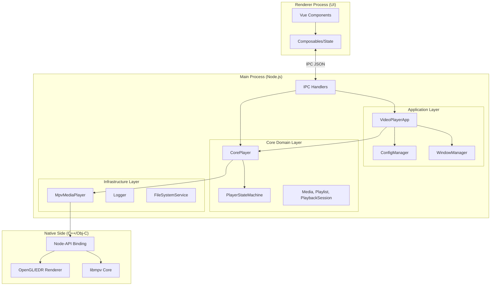
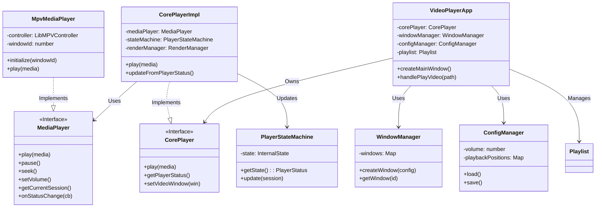
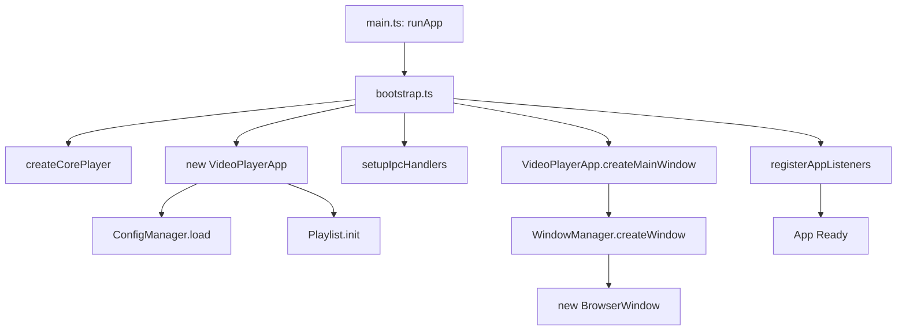
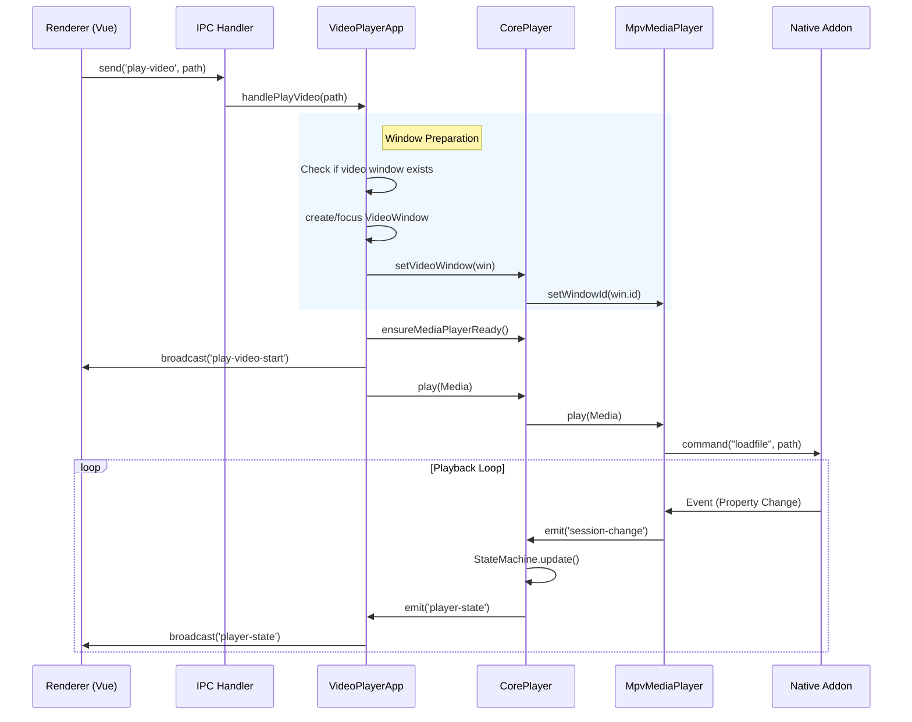
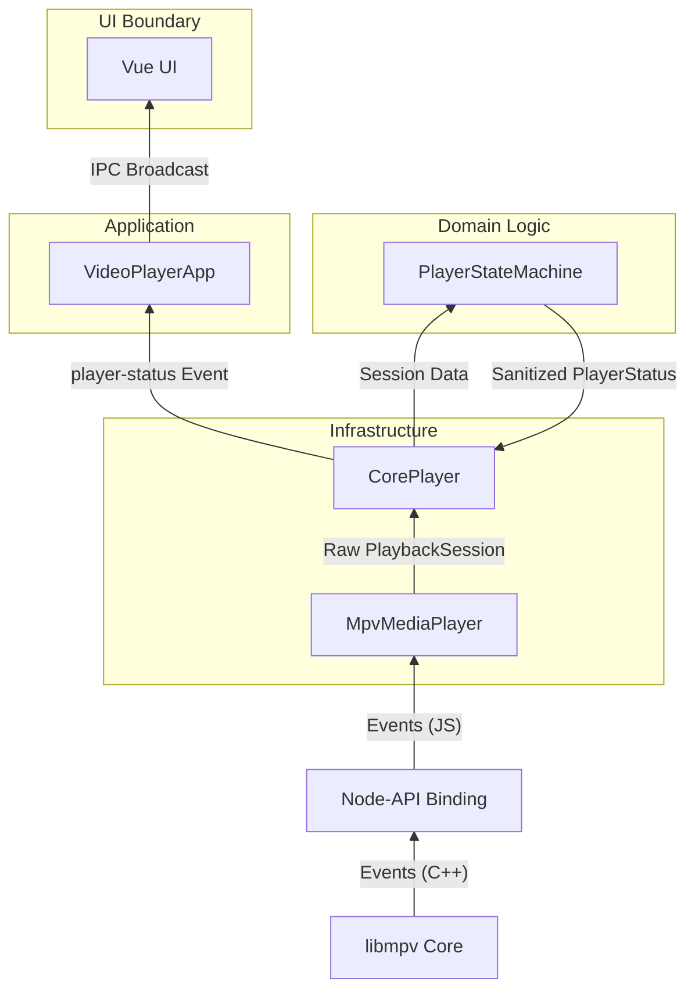
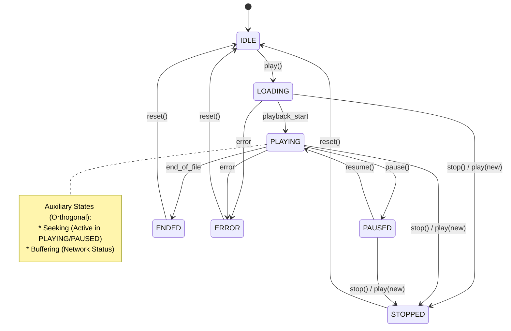
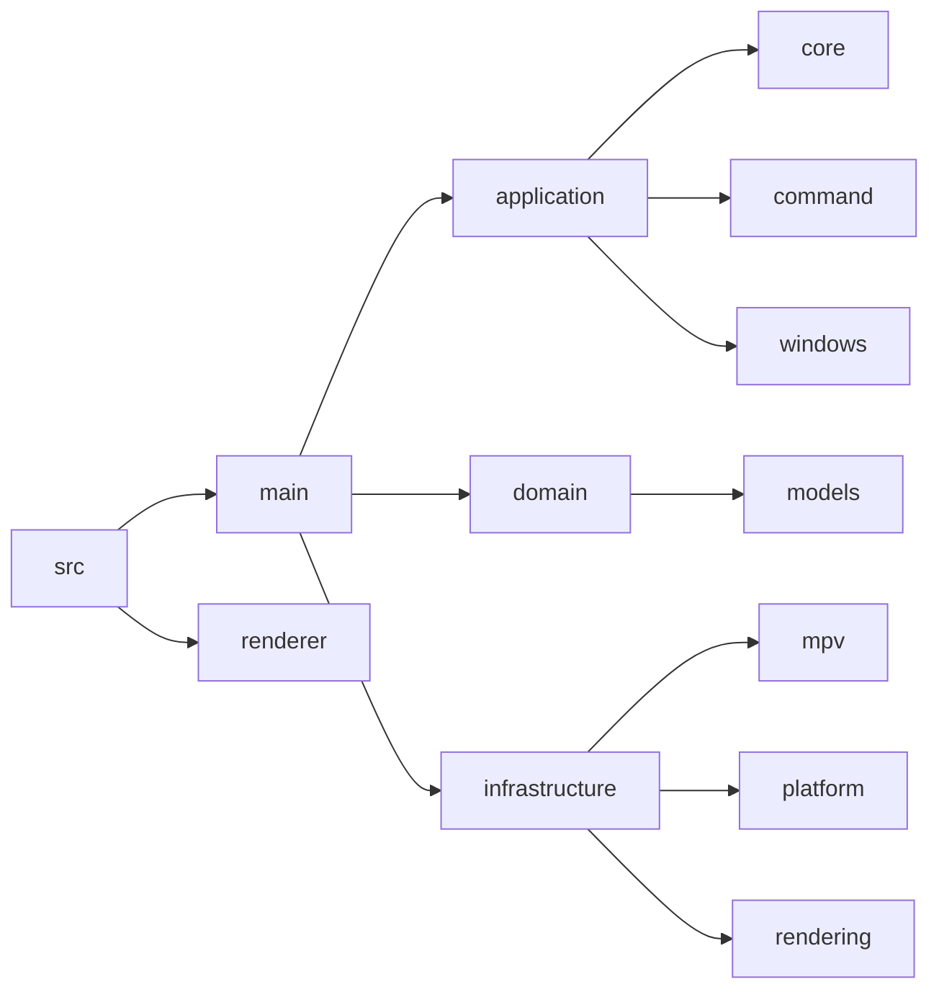

# mpv-player Architecture

> **Note**: This document is the **Single Source of Truth** for the system architecture. All code changes must be reflected here immediately.

## 1. System Overview

**mpv-player** is a high-performance desktop media player built on **Electron**, leveraging **libmpv** via a custom **Node Native Addon** (C++/Objective-C) to deliver cinema-grade rendering (HDR/Dolby Vision) on macOS and Windows.

### 1.1 Core Value Proposition
- **Correct HDR Output**: Uses macOS `CAOpenGLLayer` with EDR (Extended Dynamic Range) support and PQ color space.
- **Modern Tech Stack**: Vue 3 Composition API + TypeScript + Electron + Node-API.
- **Robust Architecture**: Domain-Driven Design (DDD) principles with strict layering and state machine-driven logic.

---

## 2. High-Level Architecture (Architecture Diagram)

The system follows a strict **Layered Architecture**. Dependencies flow **inwards** (or downwards).

### 2.1 Key Modules Responsibilities

| Layer | Module | Responsibility |
| :--- | :--- | :--- |
| **UI** | `src/renderer` | User interaction, strictly "dumb" components driven by state from Main. |
| **Command** | `ipcHandlers` | **Router**. Decodes IPC messages and dispatches to Application Layer. No business logic. |
| **Application** | `VideoPlayerApp` | **Orchestrator**. Manages Windows, Playlist, Config, and high-level user intents. |
| **Core** | `CorePlayer` | **Engine Facade**. Manages the lifecycle of the playback engine and state machine. |
| **Infrastructure** | `MpvMediaPlayer` | **Adapter**. Translates generic `MediaPlayer` commands into `libmpv` C calls. |
| **Native** | `native/` | **Bridge**. Handles the C++ <-> JS boundary and platform-specific rendering. |

---

## 3. Core Class Design (Class Diagram)

This diagram details the static structure and relationships between the main classes.

---

## 4. Execution Flows (Flowcharts & Sequence Diagrams)

### 4.1 Application Startup Flow

### 4.2 Play Video Sequence (User Interaction)

### 4.3 State Update Flow (Data Flow)

How data bubbles up from the low-level engine to the UI.

---

## 5. State Management

The player logic is driven by a finite state machine to ensure deterministic behavior.

### 5.1 State Synchronization Strategy
*   **Source of Truth**: `libmpv` internal state.
*   **Polling/Events**: `MpvMediaPlayer` listens to `libmpv` events (via Native Addon) and updates `PlaybackSession`.
*   **Sanitization**: `PlayerStateMachine` takes raw `PlaybackSession` and derives a clean `PlayerStatus` (handling edge cases like "seeking while paused").
*   **Broadcast**: The sanitized `PlayerStatus` is broadcast to the UI via IPC. **UI never queries state directly; it only reacts to broadcasts.**

---

## 6. Directory Structure Mapping

## 7. Development Guidelines

### 7.1 Modifying Architecture
*   **Strict Layering**: Never import `VideoPlayerApp` into `CorePlayer`. Dependencies point down.
*   **Interface First**: If changing `CorePlayer` functionality, update the `MediaPlayer` interface first if it affects the contract.
*   **Single Source of Truth**: Update this document before merging any architectural changes.
